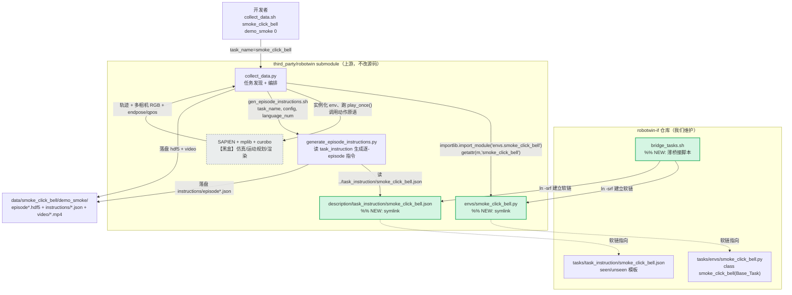

# 架构：任务桥接（task bridging）

> 维度说明：这份文档讲的是**代码架构层面**——桥接机制在 RoboTwin 系统里所处的位置、跟哪些模块打交道、我们的实现具体动了哪里。问题/需求层面（为什么要复刻、5个任务集是什么）见 `docs/design.md`。

## 一、这个 feature 在系统里的位置

RoboTwin 2.0 跑一个任务（采数据 `collect_data.py` / 评测 `eval_policy`）时，**完全靠 `task_name` 这个字符串去若干固定目录里按约定名字找文件**。它从不 import 我们的仓库，也不知道 `robotwin-if` 的存在——它只认 submodule 内部这几个目录里叫 `{task_name}.*` 的文件。

桥接要解决的就是这件事：**我们的任务文件维护在 `robotwin-if` 自己的 `tasks/` 目录（不改 submodule 源码），但要让 RoboTwin 在运行时"看见"它们**。手段是 symlink——把 `tasks/` 下的文件软链进 submodule 对应目录，RoboTwin 的 `task_name` 查找就透明地命中我们的文件。

顺着 `collect_data.py` 的调用关系往外看一层，发现按 `task_name` 命名对齐的注入点有 **3 处**（不是最初以为的 1 处）：

| # | 注入点（submodule 内路径） | 谁来读 | 命名规则 |
|---|---|---|---|
| 1 | `envs/{task_name}.py` | `collect_data.py:23` `importlib.import_module(f"envs.{task_name}")` + `:25` `getattr(module, task_name)` | 文件名**和类名**都必须 == `task_name` |
| 2 | `description/task_instruction/{task_name}.json` | `collect_data.py:232` → `gen_episode_instructions.sh` → `generate_episode_instructions.py:133` `load_task_instructions()` | 文件名 == `task_name` |
| 3 | `description/objects_description/{obj_id}_{name}/` | 指令/物体描述生成管线（任务用到**新物体**时才需要） | 目录名 == `{obj_id}_{name}` |

复用现有 120 个物体的任务（如 smoke test 用的 click_bell）只需注入点 1、2；注入点 3 留给后续用到新物体（如抽屉柜）的任务。

## 二、高层流程图（黑盒视角）

图例：绿色=这次新增（桥接脚本 + 两处 symlink）；灰色虚线框=黑盒（仿真引擎，这次完全不碰内部）；实线箭头=运行期调用/数据流，虚线箭头=symlink 指向关系。

## 三、高层实现说明

### 1. 我们动了哪些"框"的边界

- **完全没动 submodule 里任何源码**（`collect_data.py` / `generate_episode_instructions.py` / SAPIEN 等一字未改）。
- **新增了仓库侧的 `tasks/` 源文件**：`tasks/envs/smoke_click_bell.py`（逐字复制自上游 `click_bell.py`，只改第 8 行类名 `click_bell` → `smoke_click_bell`）和 `tasks/task_instruction/smoke_click_bell.json`（逐字复制自上游 `click_bell.json`）。
- **新增 `bridge_tasks.sh`**：唯一真正"改动 submodule 工作区"的地方——但它只往注入点目录里放**软链**，不写实体文件、不碰上游 tracked 文件。用 `ln -srf` 建相对软链（`envs/smoke_click_bell.py -> ../../../tasks/envs/smoke_click_bell.py`），仓库整体移动后软链仍有效。幂等，可反复跑。

### 2. 数据/调用从哪进、经过什么、到哪出

**入口**：开发者跑 `collect_data.sh smoke_click_bell demo_smoke 0`，`task_name=smoke_click_bell` 这个字符串是唯一的"钥匙"。

**桥接点1（代码发现）**：`collect_data.py` 的 `class_decorator` 用 `importlib.import_module("envs.smoke_click_bell")` 去 `envs/` 找模块——命中我们的软链，透明加载到 `tasks/envs/smoke_click_bell.py`，再 `getattr(module, "smoke_click_bell")` 拿到类（**这一步就是"文件名和类名都要 == task_name"规则的来源**）。

**仿真（黑盒）**：拿到 env 实例后，`collect_data.py` 驱动 SAPIEN/mplib/curobo 跑脚本化专家演示，吐出轨迹 + 多相机 RGB + endpose/qpos。

**桥接点2（指令生成）**：仿真结束后 `collect_data.py:232` 起子进程跑 `gen_episode_instructions.sh` → `generate_episode_instructions.py`，它 `load_task_instructions("smoke_click_bell")` 去 `description/task_instruction/` 读 json——命中第二处软链，透明读到我们的 `tasks/task_instruction/smoke_click_bell.json`，据此实例化出每个 episode 的 seen/unseen 指令。

**出口**：`data/smoke_click_bell/demo_smoke/` 下 `episode*.hdf5`（轨迹+图像）、`instructions/episode*.json`（指令）、`video/*.mp4`。验证结果：3/3 episode 成功，指令确实来自我们注入的模板（seen 100/unseen 100，样例 `"Click the white dome bell's top center using the left arm."`）。

### 3. 为什么其余的框可以当黑盒

- **SAPIEN + mplib + curobo（仿真引擎）**：桥接只决定"加载哪个任务类、读哪份指令模板"，任务类内部调的动作原语（`grasp_actor` / `move_by_displacement` 等）和物理仿真行为跟"文件从哪来"完全无关。接口没变、这次逻辑也不需要碰它，纯黑盒。
- **`collect_data.py` / `generate_episode_instructions.py`**：它们是"读取方"，我们没改它们一行代码，只是让它们按既有约定（`task_name` 命名）去查找时，查到的是我们的软链。它们对"文件是实体还是软链"无感知——这正是 symlink 方案成立的根本原因：**在文件系统层做透明注入，不需要上游有任何插件/注册机制**。

## 四、桥接方案的边界与已知约束

- 软链注入会让 submodule 工作区多出 untracked 软链（`git status` 在 submodule 里能看到），但 superproject 只跟踪 submodule 的 commit 指针，不受影响。
- 注入点3（`objects_description`）`bridge_tasks.sh` 里已预留 glob，但当前无新物体、为空跑（nullglob 跳过）。后续用新物体的任务需在 `tasks/objects_description/` 放描述再桥接。
- 评测侧（`eval_policy.sh multitask --config`）走的是同一套 `importlib` 发现机制 + 一份仓库自维护的 `all_tasks_plus_if.yml`（`--config` 接受任意路径），因此桥接方案对"合并评测"同样成立——详见 `docs/design.md` §合并评测可行性调研。
