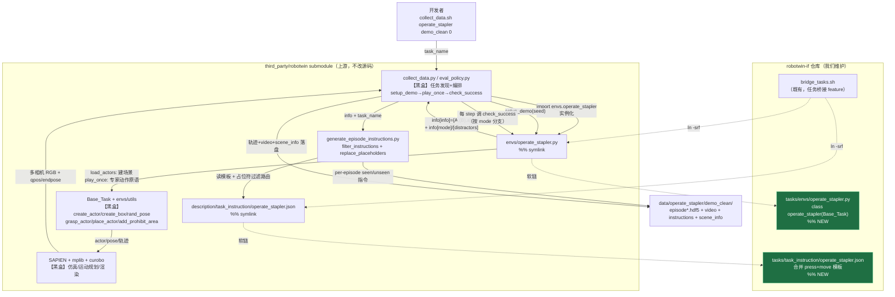

# 架构：Operate-Stapler 任务

> 维度：**代码架构层面**——这个任务在 RoboTwin 系统里所处的位置、跟哪些模块打交道、我们的实现具体动了哪里。问题/需求层面见 `understanding.md`；逐字段映射+验证证据见 `operate_stapler-impl-verify.md`；桥接 symlink 机制见 `../2026-08-19-task-bridging/architecture.md`（本文不重复）。

## 一、这个 feature 在系统里的位置

RoboTwin 跑一个任务（采集 `collect_data.py` / 评测 `eval_policy.py`）时，**完全靠 `task_name` 字符串按约定名去固定目录找文件**，从不 import 本仓。`bridge_tasks.sh` 把 `tasks/` 下我们的文件 symlink 进 submodule，RoboTwin 的 `task_name` 查找就透明命中。

顺着调用关系往外看一层，`operate_stapler` 这个任务类**只做一件事**：被 orchestrator 实例化后，暴露 `setup_demo / play_once / check_success` 三个钩子，内部调用一批 Base_Task 提供的动作/建场景原语。它**不感知** pipeline、不感知仿真引擎——这些对它是黑盒。反过来，它产出的 `info["info"]` 又喂给独立的指令生成模块。

**关键：`operate_stapler` 的特殊性在于一个 `self.mode` 枢纽跨越三个接触点**——建场景（load_actors）、专家+写 info（play_once）、判定（check_success），三处读同一个由 seed 派生的 mode。指令模块靠 info 里带不带 `{B}` 自动路由到对应动词的模板。

## 二、高层流程图（黑盒视角）

（`%% NEW` = 本 feature 新增；绿色节点为我们维护的文件；标"黑盒"的框这次没碰、只用它对外接口。）

## 三、高层实现说明

### 1. 我们改了哪个框

**只改了两个绿色框**（`tasks/envs/operate_stapler.py` + `tasks/task_instruction/operate_stapler.json`），submodule 内所有框**一行没动**。桥接靠既有 `bridge_tasks.sh`（上一个 feature 建的），本次没改它。

任务类内部逻辑（我们写的）：
- `load_actors`：`self.mode = seed%2` 采出后，建"订书机 + 彩色垫 + 1~2 stable 办公干扰物"的同一套场景（仅 `is_static` 随 mode 变）。
- `play_once`：按 mode 分支跑专家（press 复用按压序列 / move 复用抓取-抬-对齐放置），写 `info`——**press 不写 `{B}`、move 写 `{B}`**。
- `check_success`：按 mode 分支判定（复用两原生任务的判据）。

### 2. 数据/调用怎么进出

- **进**：orchestrator（黑盒）按 `task_name` import 我们的类、调 `setup_demo(seed)`。seed 是唯一外部输入，经 `Base_Task._init_task_env_` 播种 np.random 后进 `load_actors`。
- **中**：`load_actors`/`play_once` 调 Base_Task 的建场景/动作原语（黑盒）→ 这些原语驱动 SAPIEN（黑盒）。
- **出（两路）**：
  1. 轨迹/RGB → orchestrator → 落盘 hdf5/video。
  2. `info["info"]`（含/不含 `{B}`）→ `generate_episode_instructions`（相关模块，需理解其 `filter_instructions` 精确匹配占位符集合的逻辑，因为 mode 路由靠它）→ 读我们的 json 模板 → per-episode 指令落盘。
- `info["mode"]`/`info["distractors"]` 走 `info` 顶层（不进 `info["info"]`，否则会被当占位符参数、静默丢 episode）→ scene_info.json。

### 3. 为什么其余框是黑盒

- **collect_data.py / eval_policy.py**：配置驱动的任务发现+编排，对"任务做什么/怎么算成功"完全多态——只调我们的三个钩子、不关心内部。接口没变，这次不碰。
- **Base_Task + envs/utils 原语**：我们只是**调用方**，`create_actor`/`grasp_actor`/`place_actor` 等接口按原样用（沿用两原生 stapler 任务的调法）。唯一需要知道的内部事实是**调用顺序坑**（`self.info` 在 `load_actors` 之后才初始化——见 gotchas），不需要改它。
- **SAPIEN/mplib/curobo**：仿真/规划/渲染引擎，纯黑盒。
- **generate_episode_instructions.py**：没改它，但**不是纯黑盒**——mode 路由正确性依赖它 `filter_instructions` 的"占位符集合精确匹配（arm 可选）"行为，所以图里展开标注了它的职责（这是理解本任务 `{B}` 路由的关键接口）。
