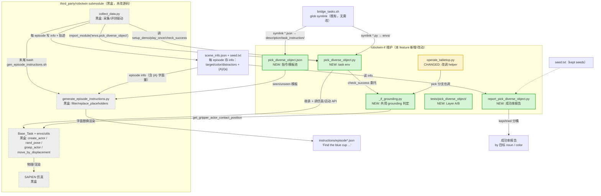

# Pick-Diverse-Object — 架构文档

> feature-04。跟 `understanding.md`（做什么/为什么）不同维度——这里讲**代码架构**：这个 task 在 RoboTwin 系统里的位置、跟哪些模块打交道、我们的实现动了哪里。

## 系统位置一句话

RoboTwin 的采集/评测驱动（`collect_data.py` / `eval_policy.py`）靠 **`importlib.import_module(f"envs.{task_name}")`** 按名字发现任务。我们把一个 `pick_diverse_object.py`（继承 `Base_Task`）+ 一份指令模板 json **symlink 进 submodule** 的对应目录，就"插"进了这条既有流水线——不改 submodule 一行源码。本 feature 的全部新增都在 `robotwin-if` 自己的目录里。

## 高层流程图（黑盒视角）

## 高层实现说明

### 1. 我们改了哪些框

**只新增了 5 个 robotwin-if 侧的框 + 改了 1 个既有框，submodule 的框全没碰：**

- **`pick_diverse_object.py`（NEW，核心）**：继承 `Base_Task`，实现 3 个被驱动调用的接口——
  - `setup_demo(seed)` → 捕获 seed → `load_actors()`：`seed % 12` 确定性选目标 + 从 12 品类均匀抽 3 干扰 + 逐物体 qpos/旋转/bottle 站躺，全部靠 submodule 的 `create_actor`/`rand_pose` 落到桌上。
  - `play_once()`：逐物体分派 `grasp_actor` 参数 + 世界系 `move_by_displacement` 抬起（都是 submodule API），并把 `info["info"]={"{A}":"the {color} {noun}","{a}":arm}` 等写进 `self.info`。
  - `check_success()`：委托给 `_if_grounding`。
- **`_if_grounding.py`（NEW，共用）**：`named_object_lifted_and_held()`——目标 z 抬离 >0.02 且仍被夹爪接触。被 pick_diverse_object 和 operate_tabletop 共享。
- **`pick_diverse_object.json`（NEW）**：借 adjust_bottle 的 orientation-free 句式（12 seen / 4 unseen），占位符 `{A}`/`{a}`。
- **`report_pick_diverse_object.py`（NEW）**：读 `scene_info.json` + `seed.txt`，从 seed 确定性反推目标，按 noun/color 分桶算成功率。
- **`operate_tabletop.py`（CHANGED）**：pick 分支原本内联判定，改成调 `_if_grounding`（DRY，回归 7/7 未变）。

### 2. 数据/调用怎么流动（进→出）

1. **接入**：`bridge_tasks.sh`（既有 glob 脚本，无需改）把 `tasks/envs/*.py`、`tasks/task_instruction/*.json` symlink 进 submodule 的 `envs/`、`description/task_instruction/`——从此 `envs.pick_diverse_object` 可被 import。
2. **采集**：`collect_data.py` import 我们的 env → 循环 `setup_demo(seed)`→`play_once()`→`check_success()`。场景搭建/抓取/判定全经由 `Base_Task`+utils 打到 SAPIEN。成功的 episode：seed 记入 `seed.txt`、`self.info` 记入 `scene_info.json`、轨迹存 hdf5。
3. **指令渲染**：采集末尾 `collect_data` 调 `gen_episode_instructions.sh`→`generate_episode_instructions.py`，读我们的 json 模板 + scene_info 里每个 episode 的 `info["info"]`，把 `{A}`（字面量 "the blue cup"，不含 `/` 故走**字面替换**而非随机描述）渲成 `instructions/episode*.json`。
4. **报告**：`report_pick_diverse_object.py` 读 scene_info + seed.txt 出成功率。

### 3. 为什么其余框是黑盒

- **`collect_data.py` / `eval_policy.py`**：配置驱动、按 `task_name` import——我们只要提供符合 `Base_Task` 接口的类，它就能调，**接口没变、逻辑不用碰**。
- **`Base_Task` + utils / SAPIEN**：是"平台能力"（建 actor、运动规划、物理）。我们只是**调用方**，`create_actor`/`grasp_actor`/`move_by_displacement` 等签名照原生用，没改其内部。
- **`generate_episode_instructions.py`**：native 的占位符替换引擎。我们靠**约定**接入（`{A}` 填字面量 → 走它既有的"非路径即字面替换"分支），没改它——这也是为什么不需要 `objects_description`。
- **`bridge_tasks.sh`**：glob 通配，丢文件进去自动 symlink，新增 task 无需改脚本。

**一句话**：我们是往一条既有的、按名字发现任务的流水线上**挂了一个新任务节点**，所有交互都走既有接口，故 submodule 侧全部可当黑盒。
