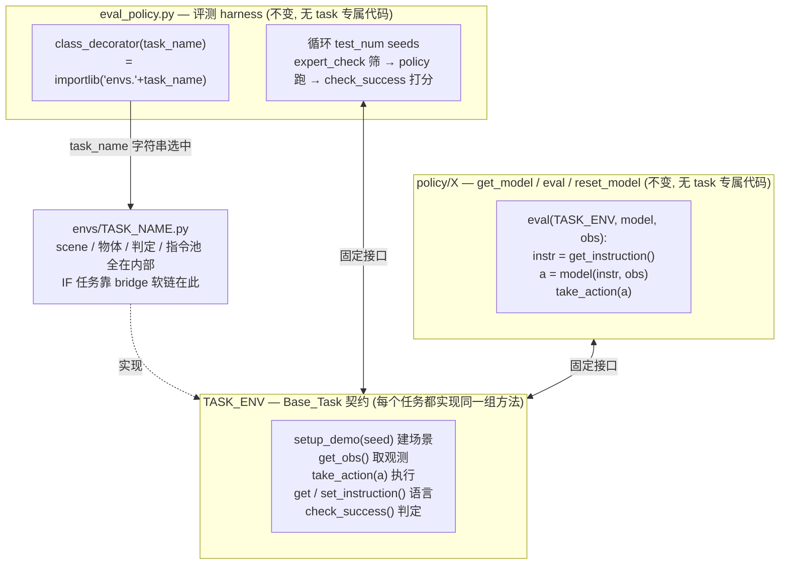

# Raw eval 调用链 + 「改 task 名即可 eval 新任务」的结构分析

> 目的：搞清楚 RoboTwin 原生怎么 eval 一个任务，以及我们新增的 IF 任务能不能「只改命令里的 task 名」就 eval。
> 结论先行：**harness/接口层「改名即可、零修改」为真；唯一不自动的是「checkpoint 得覆盖这个任务」。**
> 相关：指令管线细节见 `notes/2026-08-27-instruction-template/understanding.md`（collect+eval 都复用同一份模板池）。

---

## 0. Raw eval 命令（官方 README 写的）

**没有顶层 eval 入口**（root 只有 `collect_data.sh`）。eval 一律进某个 policy 目录跑它的 `eval.sh`：

```bash
cd policy/<PolicyName>
bash eval.sh ${task_name} ${task_config} ${ckpt_setting} ${expert_data_num} ${seed} ${gpu_id}
# 官方原生示例（TinyVLA/DexVLA README 逐字）：
bash eval.sh beat_block_hammer demo_randomized 0 50 0 0
#              └task           └config         │ │ │ └gpu
#                                              │ │ └seed
#                                              │ └expert_data_num=50
#                                              └ckpt_setting=0
```

`eval.sh` 内部 `cd ../..` 回 repo 根 → `python script/eval_policy.py --config policy/<X>/deploy_policy.yml --overrides --task_name ...`。

注：入参签名**每个 policy 自定义**，多数是这 6 个，但 GO1 是 5 个（无 `expert_data_num`）、openvla-oft 第 6 位是 builder 名。

---

## 1. 核心结论：改 task 名就能 eval，别处零改动

`bash eval.sh pick_diverse_object demo_randomized 0 50 0 0` —— 把 `beat_block_hammer` 换成我们的 IF 任务名即可，harness/policy 一行不用改。**为什么？因为三层解耦，task 名是唯一变量。**



---

## 2. 为什么改名就够（四条）

1. **任务发现是字符串驱动**：harness 只有 `importlib("envs."+task_name)` 这一个 task 输入。名字能解析成 env 类就行——IF 任务靠 `bridge_tasks.sh` 软链进 `envs/`，对 harness 与原生任务完全等价。

2. **env 暴露统一契约（Base_Task）**：`setup_demo / get_obs / take_action / get_instruction / check_success` 每个任务都实现、签名一致。harness 从不碰 task 专属字段，只调这组方法 → driver 代码零改。

3. **指令也是 task 名 keyed**：`generate_episode_descriptions(task_name, ...)` 读该任务 bridged 的 JSON + scene_info 占位符，同一条管线，IF 指令池自动接上，`instruction_type` 默认 `unseen`（IF-correct）。

4. **policy 同样 task-agnostic**：policy 的 `eval()` 只消费 `get_instruction()`+`get_obs()`、吐 `take_action()`，**不知道也不关心**是哪个任务，只做 (语言+观测)→动作 的映射 → 同一 policy 能跑任意任务。

**一句话**：task 专属的东西（场景/物体/判定/指令）全封装在 env 内部，env 由 task 名选中；harness 和 policy 是不变的外层，只通过固定接口对话。

---

## 3. 必须点破的前提：「能跑」≠「有意义」

「改名即可」成立于 **harness/接口层**。结果有没有意义，取决于 **policy 权重认不认得这个任务**：

| policy 类型 | 改名后 | 说明 |
|---|---|---|
| 语言泛化 VLA（训练含该 IF 任务/够通用） | ✅ 跑通且有意义 | 靠 instruction 条件化，对新任务出合理动作 |
| baseline（随机/默认动作） | ✅ 跑通，chance-level | 设计上 task-agnostic，`ckpt`/`data_num` 退化成被忽略的标签 |
| 单任务专家 ckpt（只训过 beat_block_hammer 的 DP） | ⚠️ 跑通但 ~0 分 | 权重没见过新任务，动作全错——机械能跑，语义无效 |

所以严格说：**harness 层「改名即可、零修改」为真；唯一不自动的是「checkpoint 得覆盖这个任务」。** `ckpt_setting`/`expert_data_num` 在命令里就是用来定位「哪次训练的权重」——它得是一次**包含该任务（或足够泛化）**的训练。

**推论（回到「不训练模型」）**：baseline policy 最省，正因它落在表格第二行——天生 task-agnostic、不需要任何 task-specific checkpoint，所以 `bash eval.sh <任意 IF 任务> ...` 一律能真跑出 chance-level 数字。这也是 Layer C 区分度验证的自然入口。

---

## 4. 和 collect 的对照

| | collect | eval |
|---|---|---|
| 任务发现 | `importlib("envs."+task_name)`（bridge） | 同 |
| 多任务 | 循环 `collect_data.sh <task> ...` | 循环 `policy/<X>/eval.sh <task> ...` |
| 是否需外挂 | 否，oracle 内建于 env | **是，必须挂 policy 模块**（无 oracle-only 模式） |
| 改 task 名即可 | ✅ | ✅（harness 层）；但需 policy 权重覆盖该任务 |

---

## 附：关键源码位置

- `script/eval_policy.py` — `class_decorator`(L28, importlib) / `main`(L64) / `eval_policy` 循环(L189, `expert_check`) / `parse_args_and_config`(L327)
- `policy/Your_Policy/deploy_policy.py` — policy 接口模板（`get_model`/`eval`/`reset_model`）
- `policy/*/deploy_policy.yml` — `instruction_type: unseen` 默认值
- `policy/{TinyVLA,DexVLA,GO1}/README.md` — 官方 eval 命令示例
- `bridge_tasks.sh` — IF 任务注入 `envs/`
