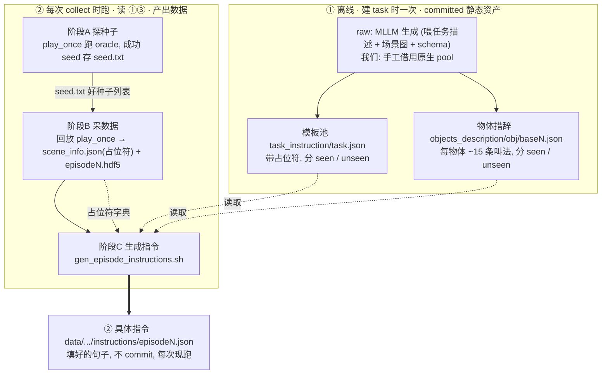
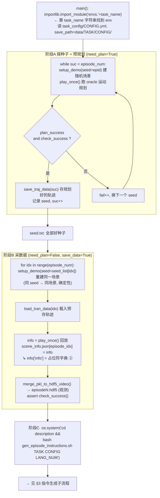
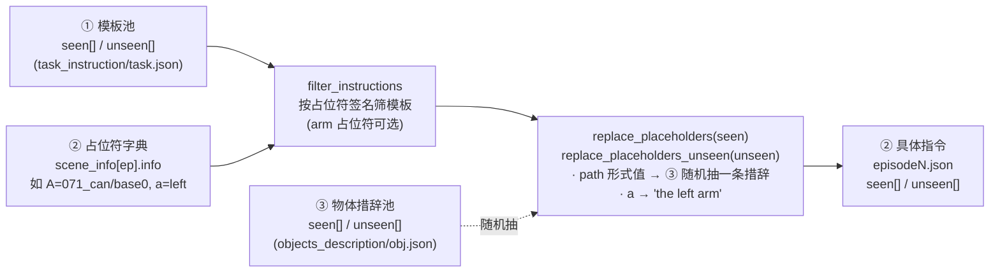
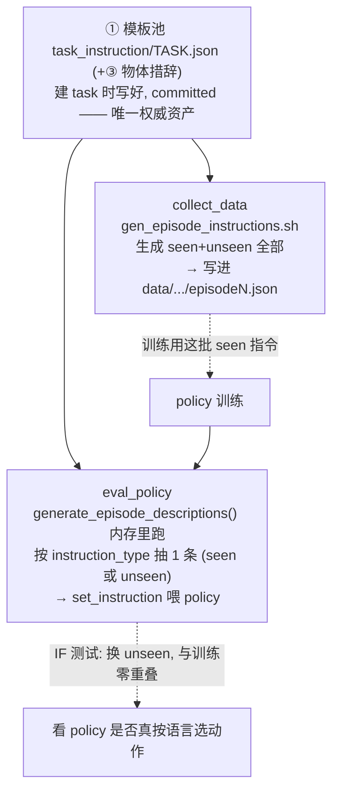
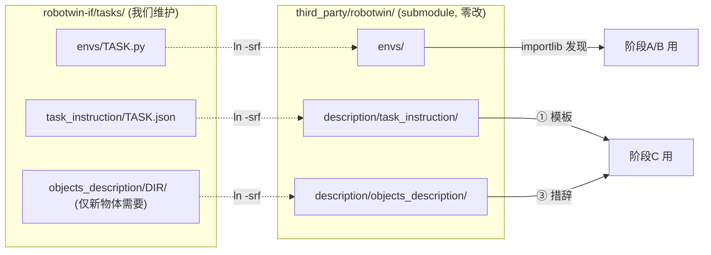

# RoboTwin 原生 collect + 指令生成管线（feature-07 前置理解）

> 目的：为 feature-07「指令模板接入」打底 —— 先彻底搞清楚 **raw RoboTwin 是怎么生成指令的**，
> 我们能不能 follow、已经 follow 到哪、还差什么。结论先行：**阶段2（每 episode 实例化）我们已完全 follow；
> 唯一偏离的是阶段1（模板池来源）—— raw 用 MLLM，我们手工借用原生 pool。**

---

## 0. 一句话心智模型

「instruction」这个词被用在**两个完全不同的东西**上，混淆全来自这里：

| | ① 模板池 template pool | ② 具体指令 concrete instruction |
|---|---|---|
| 文件 | `description/task_instruction/{task}.json` | `data/{task}/{config}/instructions/episode{N}.json` |
| 长相 | 带占位符：`"Pick {A} with {a}."` | 填好的句子：`"Pick the white can with the left arm."` |
| 谁生成 | **MLLM 离线生成**（我们=手工借用） | **确定性脚本**填充，**不碰 MLLM** |
| 何时 | **建 task 时一次性**，提前存好 | **每次 collect 结束后**批量生成 |
| 进 git | ✅ committed 在 repo | ❌ 每次 collect 现跑进 `data/` |
| raw 有吗 | ✅ 每任务自带 | ❌ collect 时才有 |

**MLLM 只在写①时出场一次**（离线写文案的工具），collect 全程不碰 MLLM。

---

## 1. 全景：两条时间线



**怎么读**：①③ 先在建 task 时备好（committed）→ collect 时 A→B→C 依次跑 → C 读①②③拼出②（现跑）。

---

## 2. collect_data.py 三阶段（细节）

`script/collect_data.py` 的 `run()` 实际是三段式：



关键点：
- **阶段A 和 阶段B 都调 `play_once()`**，但目的不同：A 是**规划+筛种子**（跑得通才留），B 是**回放+采观测数据+写 scene_info**。
- **同一个 seed 保证 A/B 重建出完全一样的场景**（RoboTwin 随机化全由 seed 驱动）。
- **`info['info']`（②占位符字典）只在阶段B 写进 scene_info.json**，这是 env 给指令生成的唯一输入。
- **阶段C 在整个 episode 循环结束后，一次性批量**生成所有 episode 的指令。

---

## 3. 指令生成子流程（阶段C 内部 = `generate_episode_instructions.py`）

**纯确定性、不调 MLLM**，就是查表 + 字符串替换：



**两处筛选逻辑**（`generate_episode_instructions.py`）：
- `filter_instructions`：只保留**占位符集合与该 episode 参数完全匹配**的模板（arm 类单字母占位符允许缺省）。这是 seen/unseen 多分支任务的**路由机制** —— 比如 place_relative 靠 `{B}`（beside）vs `{C}`（on-top）签名把两种关系分开。
- `replace_placeholders`：值若是 **path 形式**（含 `/`，如 `071_can/base0`）→ 去 `objects_description/071_can/base0.json` **随机抽一条 seen 措辞**；arm 占位符 → `"the {value} arm"`；否则字面替换。unseen 版本抽 unseen 措辞（空则回退 seen）。

---

## 4. 一个真实 episode 走完全程（raw place_can_basket）

用仓库里真实数据拼一遍：

```
① 模板 (committed):
   "Pick {A} with {a}, drop it in {B}, lift {B} with another arm."

② env 给的占位符 (阶段B 写进 scene_info):
   {"{A}": "071_can/base0", "{B}": "...basket...", "{a}": "left"}

③ 物体措辞池 (committed), 071_can/base0.json:
   seen = ["white can", "medium metal can", "can with gold top lid", ...]
                         ↑ 随机抽一条

────────────────────────────────────────────────────────────────
阶段C 输出 (进 data/, 不 commit):
   "Pick the white can with the left arm, drop it in the ..., lift ... with another arm."
```

同一模板，不同 episode 因②物体不同、③随机措辞不同 → 产出不同句子。**多样性就是这么来的**，不是运行时 MLLM。

---

## 5. seen/unseen 隔离到底在哪一层

IF 基准的核心（训练/评测语言零重叠）靠**两层** seen/unseen 隔离：

1. **模板层**：`task_instruction` 的 `seen[]` vs `unseen[]` 两个数组。
2. **物体措辞层**：`objects_description` 的 `seen[]` vs `unseen[]`。

- **path 形式**占位符（如 tabletop 的 `{A}=050_bell/base3`）→ **两层都吃到**（模板 seen/unseen × 物体措辞 seen/unseen）。
- **字面形式**占位符（如 pick/place 的 `{A}="the blue cup"`）→ **只吃模板层**。这是 grounding 可控的**代价与目的**：颜色+名词必须锁死，不能让物体措辞随机化把 "cup" 换成同义词、丢掉颜色锚点。

---

## 6. collect 和 eval 都复用同一份①模板池

①模板池是**唯一要人产出的权威资产**，collect 侧和 eval 侧都吃它 —— 关键是 **eval 不读 collect 的产物②，而是拿同一个函数在内存里现拼**。

`script/eval_policy.py:257-260`：

```python
episode_info_list = [episode_info["info"]]                                    # ② 占位符字典 (env 给, 同 collect)
results = generate_episode_descriptions(task_name, episode_info_list, test_num)  # 读 ①③, 同一个函数
instruction = np.random.choice(results[0][instruction_type])                  # 按 seen/unseen 抽 1 条
TASK_ENV.set_instruction(instruction=instruction)                            # 喂给 policy
```



三个要点：
1. **复用的是①模板池，不是②具体指令**。eval 不读 collect 写在 `data/` 里的 `episodeN.json`，而是用同一个 `generate_episode_descriptions` 在内存现生成。collect 和 eval 各自独立地「从①现拼」。
2. **seen/unseen 分工在此落地**：collect 把 seen 指令写进训练集 → policy 学 seen；eval 用 `instruction_type=unseen`（task_config 配）抽 unseen → **训练/评测语言零重叠**，这是 IF 基准的命门。
3. **所以建 task 时的活 = 写好①（+③ 若有新物体）就够了**。collect、eval、seen/unseen 隔离全自动吃这一份① —— 也正因如此，feature-07 的核心决策是「①怎么来」（借用 vs MLLM）。

---

## 7. 三个 bridge 注入点（全靠 task_name 字符串对齐）

submodule 从不 import 我们的仓库，`bridge_tasks.sh` 用相对软链把我们的文件注入 submodule：



- **注入点1 env**：阶段A/B `importlib.import_module('envs.'+task_name)`。
- **注入点2 模板池**：阶段C 读。
- **注入点3 物体措辞**：阶段C 读（path 形式才需要）。**feature-07 唯一可能有缺口的地方** —— tabletop 用 path 形式，缺描述文件时原生 `replace_placeholders` 会直接 `exit()`。

---

## 8. 我们 5 个任务 follow 到哪 / 偏离在哪

| 环节 | raw 做法 | 我们现状 | 结论 |
|---|---|---|---|
| 阶段2 每 episode 实例化 | `gen_episode_instructions.sh` + `filter/replace` | env 的 `info['info']` 形状与原生 `place_can_basket` 一致；collect_data 调**同一个** sh；测试直接 import 原生 `filter/replace` | ✅ **已 follow，无需再造** |
| 阶段1 模板池来源 | MLLM 生成（`generate_task_description.py`，GPT-4o，**纯文本改写**，场景图那行已注释） | **手工从原生同类任务 pool 借用/裁剪** | ⚠️ **刻意偏离**（见 §9/§10） |

各任务 `info['info']` 的占位符形式（path vs 字面）：
- `operate_tabletop`：**path** — `{A}=050_bell/base{id}`、`{B}=048_stapler/base{id}`、`{C}={obj}/base{id}` → 吃 ③ 物体措辞（两层 seen/unseen）。
- `place_relative`：**字面** — `{A}="the {color} {noun}"`、`{B}/{C}=..` → 只吃模板层。
- `pick_diverse_object`：**字面** — `{A}="the {color} {noun}"` → 只吃模板层（颜色 grounding 需锁死）。
- `operate_stapler`：见 env（两分支）。

---

## 9. feature-07 的决策（阶段1 偏离的权衡）—— 已定：保持借用

**「指令模板接入」不是从头搭管线** —— 管线已在 feat-02~05 逐个接好。唯一决策：**阶段1 要不要也 follow 原生 MLLM 生成？→ 已定：保持手工借用**（double-check 证据见 §10）。

**保持现状（借用/裁剪原生 pool）** —— ✅ 选定：
- ✅ 复用型任务借来的原生措辞**更贴真实动作语义**（教训：MLLM 从零会把 "touch bell" 漂成 "ring/shake bell"）
- ✅ 确定性、可复现、零外部依赖
- ✅ pick/place 的字面 grounding，MLLM 物体描述随机化**会破坏**
- ❌ 非「官方」路径，多样性靠手工、规模有限

**follow 原生 MLLM 生成**：
- ✅ 官方路径、多样性更大、可文档化工具复现
- ❌ 需 MLLM API key + 成本 + 场景图渲染，非确定性；对复用型语义会漂移，对 pick/place 破坏 grounding

**若保持现状**，feature-07 收敛为「验证 + 补缺口 + 文档」：
1. **E2E 冒烟**：拿真实 collect 出的 `scene_info.json`，跑完整 `gen_episode_instructions.sh`，检查产出 `episodeN.json` 的 seen/unseen（需 GPU 机）。
2. **注入点3 覆盖审计**：tabletop 的 path 引用（`050_bell`/`048_stapler`/可拿物体）必须全有 `objects_description` 文件，否则 `exit()`。缺的补桥接。
3. **一致性确认**：tabletop 走 path、pick/place 走字面，确认有意为之（判断：是，为 grounding 可控）。
4. `operate_mic_drawer` 缺指令测试（已搁置，倾向跳过）。
5. 写 `docs/features/07-指令模板接入.md`。

---

## 10. Double-check：原生 MLLM 生成 vs 我们借用（实测证据）

出于 double-check 目的研究了原生 MLLM 生成机制 + 实测其输出质量，验证「保持借用」的决策。结论：**借用继承 GPT-4o 措辞红利，同时规避了原生 64% 池的质量毛病**。

### 10.1 原生两个生成器

| | 任务指令 `generate_task_description.py` | 物体描述 `generate_object_description.py` |
|---|---|---|
| 模型 | GPT-4o（Azure `d-robotics` 私有端点，需 `AZURE_API_KEY`） | 同上 |
| 输入 | **纯文本**（场景图那行 L40 已注释）：人写的 `full_description`+`preference`+`schema` | **用图**（`get_image_from_glb` 渲染 GLB→base64） |
| 干什么 | 把人写的任务描述**改写成 N 条带占位符句子** | 生成 15 条口语名词短语 |
| seen/unseen | 每 12 条：**前 2→unseen，后 10→seen**（位置划分，非语义 held-out） | 随机抽 3→unseen |

**认知修正**：任务指令侧 **不看图**，纯文本改写；人仍要手写 `full_description`/`preference`/`schema`，MLLM 只做「改写+机械划分」。只有**物体描述**是真·视觉 grounded（这块原生质量不错，如 050_bell → "white dome bell"/"bell with black flat base"）。

### 10.2 原生输出质量实测（扫全部 56 个原生池）

**36/56（64%）至少一种毛病**：

| 毛病 | 证据 | 后果 |
|---|---|---|
| `<>` 标记泄漏 | click_bell **12 条**含 `<bell's top center>` | replace 只吃 `{}`，`<>` **原样渲染进最终指令** |
| 内部重复 | click_bell unseen 里同一句**重复 3 次** | unseen 才 10 条，有效多样性更低 |
| **seen∩unseen overlap>0** | place_a2b_left=2、adjust_bottle/lift_pot/move_can_pot… **~13 个任务** | **训练/评测隔离直接漏**——IF 命门被自己破坏 |
| 动词漂移 | click_bell full_desc 是 "click"，生成大量 "Push"/"Press" | 语义偏移 |

### 10.3 我们借用池 vs 原生（同口径实测）

| 池 | `<>`泄漏 | 内部重复 | seen∩unseen | 额外保障 |
|---|---|---|---|---|
| 原生（56 个） | click_bell 12 条等 | 普遍 | **~13 个 overlap>0** | 无 |
| **我们（4 个）** | **0** | **0** | **全 0** | 测试强制签名有效 + seen/unseen 两族齐全 + 路由正确 |

### 10.4 结论

- **保持借用是对的**：继承 GPT-4o 多样性（我们池 72–96 条 seen），规避原生 64% 缺陷，复用型语义更准，pick/place grounding 不破坏。
- **follow 原生 MLLM 成本反而更高**：需 (a) Azure key 或改端点；(b) 人照样手写 full_description/preference/schema（pick/place 无原生源，全新写）；(c) 跑完还得清洗 `<>`/dup/overlap。收益仅「官方路径」名义。
- **可选中间路**（非现在必须）：想要更大 seen 多样性时，用 MLLM 对**我们已有的池增量扩充**，生成后**过我们现有清洗测试**（seen∩unseen=0、无 `<>`、无 dup）把关 —— 既拿多样性又保质量。

### 10.5 附：MLLM 生成相关源码

- `description/utils/generate_task_description.py` — 任务指令生成（L40 图已注释；L93-94 `result[2:]`→seen / `result[0:2]`→unseen）
- `description/utils/generate_object_description.py` — 物体描述生成（用图；随机 3 条→unseen）
- `description/utils/agent.py` — GPT-4o Azure 客户端（`AZURE_API_KEY`，temperature 0.8）
- `description/_generate_task_prompt.txt` / `_generate_task_prompt_schema.txt` — 任务指令 system prompt
- `description/_generate_object_prompt.txt` — 物体描述 system prompt

---

## 附：关键源码位置

- `third_party/robotwin/script/collect_data.py` — 三阶段主流程（阶段A ~L127，阶段B ~L202，阶段C `os.system(gen...)` ~L232）
- `third_party/robotwin/description/utils/generate_episode_instructions.py` — 阶段C 全部逻辑（`filter_instructions` / `replace_placeholders` / `replace_placeholders_unseen`）
- `third_party/robotwin/description/utils/generate_task_description.py` — 阶段1 MLLM 模板生成（`from agent import *`）
- `bridge_tasks.sh` — 3 注入点软链
- 我们的任务：`tasks/envs/*.py`、`tasks/task_instruction/*.json`
