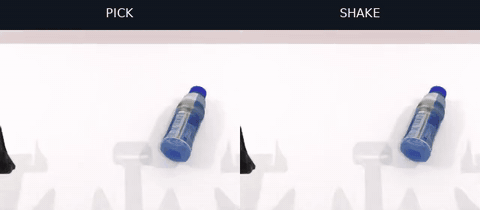
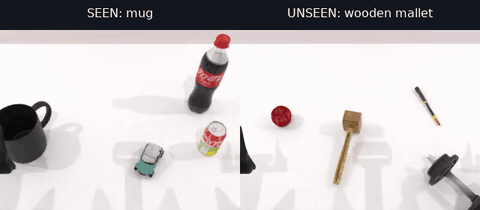
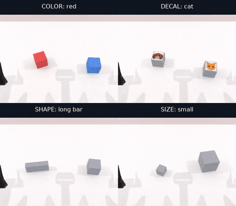
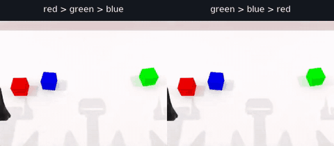
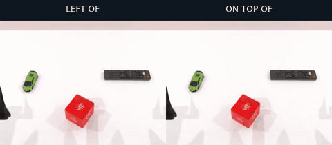

# robotwin-if

在 [RoboTwin 2.0](https://github.com/RoboTwin-Platform/RoboTwin) 上实现单轴 instruction-following diagnostic tasks。
RoboTwin 以 git submodule 锁定；任务通过软链注入。

本页展示当前评测采用的**六个任务**。Grasp-Approach 暂时退出本页的评测范围；历史七任务实现与结果保留用于追溯。

| 诊断轴 | Task name | 对比值 |
|---|---|---|
| Verb-Select | [`bottle_verb`](#bottle-verb) | pick / shake |
| Noun-Grounding | [`pick_diverse_object`](#pick-diverse-object) | 仅按名词从同 familiarity group 中选择目标 |
| Attribute-Select | [`attribute_select`](#attribute-select) | color / decal / shape / size |
| Arm-Select | [`arm_select`](#arm-select) | left / right |
| Sequence | [`stack_sequence`](#stack-sequence) | 六种 bottom-to-top 顺序 |
| Spatial-Direction | [`place_relative`](#place-relative) | left / right / front / back / on top |

本仓库维护任务场景、指令模板、成功判定及开源 policy 的推理适配，不在本仓库训练模型。
各 policy 的安装和推理说明见 [policies/](policies/README.md)。

当前 [六任务结果表](#policy-results) 与 [任务视频](#task-videos) 均可在本页查看。
[六任务 20-block seed/mode 清单](seed-manifests/if-ext-v2-six-tasks-20-per-mode/README.md) 对应每个 policy 500 回合，合计 3000 回合、720 blocks。
[结果目录](result/README.md) 同时保留当前六任务与历史七任务归档；两者的 Overall 按各自任务范围计算。

<a id="policy-results"></a>

## 六个 Policies 的评测结果

2026-09-15 归档快照：**六任务 × 每任务 20 blocks × 六个 policies**，已完成 **3000/3000 回合、720/720 blocks**。
Arm-Select 使用 v2；VLAct 使用 `StarVLA/VLAct_Qwen3OFT_Robotwin_all_Finetune`（All 100K）。

**微调数据差异：** X-VLA 使用在 RoboTwin **clean** 数据上微调的 checkpoint，其余五个 policies 使用在
**clean + randomized** 数据上微调的 checkpoint。由于 X-VLA 目前没有开源的 clean + randomized checkpoint，
本次比较采用其公开的 clean checkpoint。因此，各模型的微调数据设置并不完全一致，解读结果时需考虑这一差异。

任务列为**成功数 / 已评测回合数**，成功与已完成的 policy failure 均计入分母。
**Overall (%) = 六个任务成功率的等权平均**，每个任务内部对 modes 等权；它不等于把 500 个回合合并后的成功率。

| Policy | Verb | Noun | Attribute | Arm v2 | Sequence | Spatial | Overall (%) | 完成回合 | 完成 blocks |
|---|---:|---:|---:|---:|---:|---:|---:|---:|---:|
| [X-VLA](policies/xvla/README.md) | 25/40 | 15/40 | 100/160 | 25/40 | 0/120 | 6/100 | 38.5 | 500/500 | 120/120 |
| [LingBot-VA](policies/lingbot_va/README.md) | 23/40 | 30/40 | 145/160 | 37/40 | 17/120 | 26/100 | 59.3 | 500/500 | 120/120 |
| [LingBot-VLA](policies/lingbot_vla/README.md) | 25/40 | 13/40 | 93/160 | 15/40 | 14/120 | 3/100 | 34.2 | 500/500 | 120/120 |
| [VLAct All](policies/vlact/README.md) | 20/40 | 28/40 | 133/160 | 0/40 | 15/120 | 20/100 | 39.3 | 500/500 | 120/120 |
| [DM05](policies/dm05/README.md) | 20/40 | 25/40 | 112/160 | 39/40 | 9/120 | 21/100 | 51.4 | 500/500 | 120/120 |
| [Hy-VLA](policies/hy_vla/README.md) | 23/40 | 11/40 | 143/160 | 8/40 | 15/120 | 7/100 | 35.6 | 500/500 | 120/120 |

**待复核记录：** Hy-VLA 的 `pick_diverse_object` seed `100052`（coffee box）被用户指出视频表现失败，
其归档自动判定仍为成功；该片段已从 README 演示中撤下。上表保持归档计数，尚未据此人工修订分数，
详见 [例子替换记录](docs/assets/task-demos/README.md)。

<details>
<summary>展开各任务、各模式的成功个数</summary>

下表仍为成功数 / 已评测回合数，Avg. 为任务成功率（%）。Attribute 按子轴合并两个 target values，
每个子轴共 40 回合；其余每个 mode 共 20 回合。Sequence 的 R/G/B 表示从底层到顶层的颜色顺序，
Spatial 的 Top 表示 on_top。每个 policy 的每项任务均已完成 20/20 blocks。

### Verb — `bottle_verb`

| Policy | Pick | Shake | Avg. (%) |
|---|---:|---:|---:|
| X-VLA | 5/20 | 20/20 | 62.5 |
| LingBot-VA | 3/20 | 20/20 | 57.5 |
| LingBot-VLA | 5/20 | 20/20 | 62.5 |
| VLAct All | 0/20 | 20/20 | 50.0 |
| DM05 | 0/20 | 20/20 | 50.0 |
| Hy-VLA | 3/20 | 20/20 | 57.5 |

### Noun — `pick_diverse_object`

| Policy | Seen | Unseen | Avg. (%) |
|---|---:|---:|---:|
| X-VLA | 7/20 | 8/20 | 37.5 |
| LingBot-VA | 14/20 | 16/20 | 75.0 |
| LingBot-VLA | 10/20 | 3/20 | 32.5 |
| VLAct All | 16/20 | 12/20 | 70.0 |
| DM05 | 18/20 | 7/20 | 62.5 |
| Hy-VLA | 7/20 | 4/20 | 27.5 |

### Attribute — `attribute_select`

| Policy | Color | Decal | Shape | Size | Avg. (%) |
|---|---:|---:|---:|---:|---:|
| X-VLA | 31/40 | 24/40 | 20/40 | 25/40 | 62.5 |
| LingBot-VA | 38/40 | 35/40 | 37/40 | 35/40 | 90.6 |
| LingBot-VLA | 35/40 | 21/40 | 16/40 | 21/40 | 58.1 |
| VLAct All | 39/40 | 33/40 | 35/40 | 26/40 | 83.1 |
| DM05 | 36/40 | 25/40 | 28/40 | 23/40 | 70.0 |
| Hy-VLA | 36/40 | 35/40 | 34/40 | 38/40 | 89.4 |

### Arm v2 — `arm_select`

| Policy | Left | Right | Avg. (%) |
|---|---:|---:|---:|
| X-VLA | 20/20 | 5/20 | 62.5 |
| LingBot-VA | 20/20 | 17/20 | 92.5 |
| LingBot-VLA | 9/20 | 6/20 | 37.5 |
| VLAct All | 0/20 | 0/20 | 0.0 |
| DM05 | 20/20 | 19/20 | 97.5 |
| Hy-VLA | 1/20 | 7/20 | 20.0 |

### Sequence — `stack_sequence`

| Policy | RGB | RBG | GRB | GBR | BRG | BGR | Avg. (%) |
|---|---:|---:|---:|---:|---:|---:|---:|
| X-VLA | 0/20 | 0/20 | 0/20 | 0/20 | 0/20 | 0/20 | 0.0 |
| LingBot-VA | 17/20 | 0/20 | 0/20 | 0/20 | 0/20 | 0/20 | 14.2 |
| LingBot-VLA | 14/20 | 0/20 | 0/20 | 0/20 | 0/20 | 0/20 | 11.7 |
| VLAct All | 10/20 | 0/20 | 1/20 | 2/20 | 0/20 | 2/20 | 12.5 |
| DM05 | 9/20 | 0/20 | 0/20 | 0/20 | 0/20 | 0/20 | 7.5 |
| Hy-VLA | 15/20 | 0/20 | 0/20 | 0/20 | 0/20 | 0/20 | 12.5 |

### Spatial — `place_relative`

| Policy | Left | Right | Front | Back | Top | Avg. (%) |
|---|---:|---:|---:|---:|---:|---:|
| X-VLA | 4/20 | 2/20 | 0/20 | 0/20 | 0/20 | 6.0 |
| LingBot-VA | 12/20 | 7/20 | 0/20 | 0/20 | 7/20 | 26.0 |
| LingBot-VLA | 1/20 | 2/20 | 0/20 | 0/20 | 0/20 | 3.0 |
| VLAct All | 11/20 | 7/20 | 1/20 | 0/20 | 1/20 | 20.0 |
| DM05 | 12/20 | 8/20 | 1/20 | 0/20 | 0/20 | 21.0 |
| Hy-VLA | 2/20 | 5/20 | 0/20 | 0/20 | 0/20 | 7.0 |

</details>

数据来源：[完整结果表](result/if-ext-v2-six-tasks-20blocks/results.md) ·
[分模式 CSV](result/if-ext-v2-six-tasks-20blocks/results.csv) ·
[逐回合 CSV](result/if-ext-v2-six-tasks-20blocks/episodes.csv) ·
[Checkpoint 版本](result/if-ext-v2-six-tasks-20blocks/checkpoints.json)。

<a id="task-videos"></a>

## 六个任务与视频

每项任务聚焦一种指令差异：做什么动作、抓哪个物体、按什么属性选择、用哪只手、按什么顺序、放在哪个方向。
下方动态预览可点击打开 MP4；素材随仓库提供。视频选自正式评测中的成功回合，用于展示任务行为，
整体表现见 [完整结果](result/if-ext-v2-six-tasks-20blocks/README.md)。原始指令、seed、policy 和视频处理说明见 [素材来源](docs/assets/task-demos/README.md)。

<a id="bottle-verb"></a>

### 1. Bottle-Verb：根据动词选择动作

面对同一瓶子和初始场景，执行 **pick（拿起）** 或 **shake（摇动）**。
任务区分抬高瓶子与摇动过程，检验模型是否根据动词改变行为。
下例左右分别为 pick / shake；一个 block 包含两个回合。

[](docs/assets/task-demos/bottle_verb.mp4)

[观看 MP4](docs/assets/task-demos/bottle_verb.mp4) · 示例 policy：Hy-VLA。

<a id="pick-diverse-object"></a>

### 2. Pick-Diverse-Object：根据名词找到目标

桌上放置四个不同类别的物体，机器人需要根据指令中的**物体名词**选中并抓起目标。
**Seen / Unseen** 分别使用熟悉与未见物体池；一个 block 包含两个独立场景，每个场景内的四个物体属于同一 familiarity group。
下例分别抓取 mug 与 wooden mallet。

[](docs/assets/task-demos/pick_diverse_object.mp4)

[观看 MP4](docs/assets/task-demos/pick_diverse_object.mp4) · 左：DM05（Seen mug）；右：Hy-VLA（Unseen wooden mallet）。

<a id="attribute-select"></a>

### 3. Attribute-Select：根据视觉属性选择目标

在两个物体中按指定属性选择并抓起目标：**颜色**（red / blue）、**图案**（cat / dog）、
**形状**（block / bar）或**大小**（big / small）。同一属性的两个指令共享场景、切换目标；
一个 block 包含四组对比、共八个回合。下例依次展示 red、cat、long bar、small 四类属性指令。

[](docs/assets/task-demos/attribute_select.mp4)

[观看 MP4](docs/assets/task-demos/attribute_select.mp4) · 示例 policy：Hy-VLA。

<a id="arm-select"></a>

### 4. Arm-Select：使用指定的机械臂

对同一目标方块，分别要求用**左臂 / 右臂**抓起；用错机械臂即使抬起方块也不算成功。
当前采用 **v2** 配置：不同 blocks 改变方块的位置和朝向，同一 block 的两个回合共享布局。
下例左右分别为 left arm / right arm。

[](docs/assets/task-demos/arm_select.mp4)

[观看 MP4](docs/assets/task-demos/arm_select.mp4) · 示例 policy：DM05 · [v2 场景说明](docs/arm-select-v2.md)。

<a id="stack-sequence"></a>

### 5. Stack-Sequence：按照指定顺序堆叠

将红、绿、蓝三个方块按指令指定的**自下而上顺序**堆成三层。
同一场景对应六种排列，一个 block 包含六个回合；仅堆成塔、颜色顺序错误不算成功。
下例分别为 red → green → blue 和 green → blue → red（箭头均表示从底层到顶层）。

[](docs/assets/task-demos/stack_sequence.mp4)

[观看 MP4](docs/assets/task-demos/stack_sequence.mp4) · 示例 policy：VLAct All · 存档视频 3× 播放。

<a id="place-relative"></a>

### 6. Place-Relative：理解相对空间方向

将物体 A 放到参考物体 B 的 **left / right / front / back / on top**，场景中另有一个干扰物。
同一布局对应五种方向，一个 block 包含五个回合，检验目标放置关系是否符合指令。
下例将绿色 toycar 分别放到红色 tea-box 的左侧和顶部。

[](docs/assets/task-demos/place_relative.mp4)

[观看 MP4](docs/assets/task-demos/place_relative.mp4) · 示例 policy：VLAct All · 存档视频 1.5× 播放。

以下运行与实现说明对应本次文档提交所保留的七任务代码入口；本页的结果和演示采用上面的六任务范围。

## 设计原则：零改上游

任务源码维护在 `tasks/` 下；安全 installer 只把 canonical IF 七项及其四个 helper 软链到 RoboTwin：

- `envs/<task_name>.py`（七项）；
- `envs/_if_grounding.py`、`_if_relative.py`、`_pick_diverse_object_pool.py`、`_if_eval.py`；
- `description/task_instruction/<task_name>.json`（七项）。

历史/实验 env 即使仍在 `tasks/` 中也不会被安装；当前七项不依赖额外 object-description bridge。Installer 不修改 RoboTwin tracked 文件，尤其不会 merge 或替换 `task_config/_eval_step_limit.yml`。

Bridge 之后，RoboTwin 的 collect/eval harness 可像发现 raw task 一样通过 task name 加载新增任务。Bridge 只负责 runtime discovery；它不负责选择 balanced seeds 或计算 per-mode IF 指标。

## 用法

### 1. 环境搭建

```bash
bash setup_robotwin.sh [--assets_cache <本地资产缓存目录>]
```

安装 RoboTwin 2.0 仿真环境（SAPIEN/CUDA/curobo 等）。详见 [`docs/features/01-环境搭建.md`](docs/features/01-环境搭建.md)。

### 2. 桥接 / 解绑任务

#### 模式 A：锁定的 nested runtime（推荐）

```bash
# 默认 target = third_party/robotwin
bash scripts/bridge_tasks.sh --dry-run
bash scripts/bridge_tasks.sh
bash scripts/bridge_tasks.sh --check

# 卸载前先查看计划；真正卸载使用同一命令但去掉 --dry-run
bash scripts/unbridge_tasks.sh --dry-run
```

Nested checkout 固定在已验证的 RoboTwin commit `0aeea2d669c0f8516f4d5785f0aa33ba812c14b4`，适合 benchmark release、CI 和 CogACT/X-VLA 评测。Fresh clone、new worktree 或新的 CI job 都要重新 bridge；软链和 target-side `.robotwin-if-bridge.json` 是 workspace installation state，不属于 RoboTwin submodule commit。

#### 模式 B：接入外部 repo 已有的 RoboTwin

```bash
bash scripts/bridge_tasks.sh --robotwin-dir /path/to/external/RoboTwin --dry-run
bash scripts/bridge_tasks.sh --robotwin-dir /path/to/external/RoboTwin
bash scripts/bridge_tasks.sh --robotwin-dir /path/to/external/RoboTwin --check
```

Target 解析优先级为 `--robotwin-dir`、`ROBOTWIN_DIR`、默认 nested checkout。外部 checkout 的 commit 若不是上述 locked commit、没有可读且 target-root 精确匹配的 git metadata，或 compatibility contract files 有本地修改，默认拒绝；只有人工确认后才显式放行：

```bash
bash scripts/bridge_tasks.sh \
  --robotwin-dir /path/to/external/RoboTwin \
  --allow-compatible-commit

# mismatch checkout 的后续 check 也必须显式声明同一 opt-in
bash scripts/bridge_tasks.sh \
  --robotwin-dir /path/to/external/RoboTwin \
  --allow-compatible-commit --check
```

即使显式放行，Base_Task、instruction generator、`envs.utils` 的实际 package exports 与目录布局等静态 API contract 仍必须全部通过。Ownership manifest 记录实际 target/source commits、`source_dirty`、18 个 linked sources 的 deterministic `source_digest`、`target_contract_dirty` 和每个链接的精确 raw target；它不会把 dirty source 错写成可由 commit 单独复现，`--check` 也能发现 dirty source 内容再次变化。

Bridge 在写入前对所有 destination 做完整 preflight：正确旧链接会被 adopt，missing link 才新增，foreign/dangling symlink、真实文件或目录都会使整次安装在 mutation 前失败；不提供 `--force`。重跑 bridge 会安全清理 manifest-owned stale links 和仍指向本 source 的旧 inactive glob links。Unbridge 以 manifest 为准，因此 source 文件重命名/删除后仍可清理；被外部修改的 destination 一律 `skip-modified` 并保留 ownership 记录，绝不误删。Bridge/check/unbridge 通过 target-directory lock 串行化完整 transaction，dry-run 不新增 lock 文件。

### 3. 采集 oracle 专家演示

锁定版本的 RoboTwin collect 是单任务入口。遍历七项 IF manifest：

```bash
bash scripts/bridge_tasks.sh
cd third_party/robotwin

for t in $(python3 -c "import yaml; print(' '.join(yaml.safe_load(open('../../eval_cfg/if_tasks.yml'))['tasks']))"); do
  bash collect_data.sh "$t" demo_clean 0   # <task> <config> <gpu_id>
done
```

可执行清单：

- [`eval_cfg/if_tasks.yml`](eval_cfg/if_tasks.yml)：维护中的 IF 七项；
- [`eval_cfg/all_tasks_plus_if.yml`](eval_cfg/all_tasks_plus_if.yml)：锁定的 native 50 + 同一 IF 七项，共 57 项。

每个任务 collect 结束时会调用 RoboTwin 原生指令生成管线，无需单独执行 instruction generator。

### 4. Policy 评测

本仓库维护的策略入口见 [`policies/README.md`](policies/README.md)。X-VLA 环境安装命令为 `bash policies/xvla/setup_env.sh`，服务启动与最小评测命令见其 [README](policies/xvla/README.md)。初次闭环验证已完成：raw `click_bell` 1/1 成功，IF `arm_select` 的一个完整左右臂 block 为 1/2（左成功、右达到动作上限），结果属于 smoke 验证。每个策略先验证一个 raw RoboTwin task，再验证一个 IF task。

第二个策略 [LingBot-VA](policies/lingbot_va/README.md) 也已完成同一验证顺序：raw `click_bell` 1/1，IF `arm_select` 的完整左右臂 block 为 2/2。使用 `bash policies/lingbot_va/setup_env.sh` 安装独立环境；checkpoint 下载、服务和评测命令见该策略 README。两种策略均采用统一的 episode 输出格式；这些结果只用于初次接入验证。

[LingBot-VLA 4B](policies/lingbot_vla/README.md) 的 `robbyant/lingbot-vla-4b-posttrain-robotwin` 接入位于 `policies/lingbot_vla/`，使用独立环境和 WebSocket 端口 8012，输出 14D 绝对关节动作。真实 checkpoint 的 raw `click_bell` 1/1 成功；IF `arm_select` 完整左右臂 block 为 0/2，均达到动作上限，IF 成功验收尚未通过。安装、下载、启动及验证证据见该策略 README。

[VLAct Qwen3OFT](policies/vlact/README.md) 的 `StarVLA/VLAct_Qwen3OFT_Robotwin_Finetune` 接入位于 `policies/vlact/`，使用独立环境 `robotwin-if-vlact` 和 WebSocket 端口 8013。输入三路 RGB 与指令，按训练配置 `robotwin_wrap_32` 解码并重排 32 步、14D 绝对关节动作。真实 checkpoint 的 raw `click_bell` 1/1 成功；IF `arm_select` 完整左右臂 block 为 1/2（左达到动作上限、右成功）。安装、下载、启动和验证证据见该策略 README。

[DM05](policies/dm05/README.md) 的 `Dexmal/DM05-robotwin2` 接入位于 `policies/dm05/`，使用独立环境 `/Data/robotwin-if/envs/robotwin-if-dm05` 和 HTTP 端口 8014。输入三路 RGB、实测关节状态与指令，输出 50 步、14D 绝对关节动作。真实 checkpoint 的 raw `click_bell` 1/1 成功；IF `arm_select` 完整左右臂 block 为 2/2。安装、下载、启动、上游 CUDA Graph 回退说明和验证证据见该策略 README。

[Hy-VLA](policies/hy_vla/README.md) 的 `tencent/Hy-Embodied-0.5-VLA-RoboTwin` 接入位于 `policies/hy_vla/`，使用独立环境 `/Data/robotwin-if/envs/robotwin-if-hy-vla` 和 WebSocket 端口 8015。输入三路 RGB、六帧历史、实测末端状态与指令，按官方相对/绝对动作混合解码得到 20 步、16D 末端目标，每 7 步重规划。真实 checkpoint 的 raw `click_bell` 1/1 成功；IF `arm_select` 完整左右臂 block 为 0/2，均达到 400 步上限，IF 成功验收尚未通过。安装、下载、启动和验证证据见该策略 README。

RoboTwin 没有统一的顶层 eval 命令；每个 policy 使用自己的 `eval.sh`，参数签名也可能不同。常见入口为：

```bash
cd third_party/robotwin/policy/<PolicyName>
bash eval.sh <task_name> demo_randomized <ckpt_setting> <expert_data_num> <seed> <gpu_id>
```

- 把 `task_name` 换成 task inventory 中任一新增任务即可完成 runtime 加载；checkpoint 必须具备相应行为 repertoire，结果才有诊断意义。
- 各 policy 的 `deploy_policy.yml` 通常以 `instruction_type: unseen` 做正式 IF 评测；`seen` 只用于 sanity check。
- 原生 eval 会跳过 oracle-invalid candidate seeds，适合 smoke test，但不能保证每个 mode denominator 均衡。

七项 task 在 eval mode 使用集中维护的 policy-action budget（collect 不受影响）：

| Task | `step_lim` | Native structural analog |
|---|---:|---|
| `bottle_verb` | 700 | `shake_bottle`（取最长 shake branch） |
| `pick_diverse_object` | 400 | single grasp/lift |
| `attribute_select` | 400 | single grasp/lift |
| `arm_select` | 400 | single grasp/lift |
| `stack_sequence` | 1200 | `stack_blocks_three` |
| `place_relative` | 400 | `place_a2b_left` |
| `grasp_cube_approach` | 400 | single grasp/lift |

Mapping 位于 `tasks/envs/_if_eval.py`，task 在 `_init_task_env_` 返回后覆盖 eval limit，因此不修改 upstream config。Locked Base_Task 对未知 task 可能先打印 fallback-to-1000 提示，但 policy rollout 实际读取的是随后覆盖的固定值。现有 oracle trajectory 最大 recorded frames（按表中 task 顺序）为 255/103/89/89/479/163/99，只能支持相对复杂度判断；`step_lim` 统计 policy action calls，仍需在后续 CogACT rollout 中监测是否有 episode 撞到 limit。

正式 IF 结果不能任意跳过单个 seed。应先按 task 的完整 balance block 验证并固化 seed manifest，再让所有 policy 重放同一批 episodes。这里的 block 不一定是同一物理场景：`attribute_select` 的 8-seed block 包含四个 same-scene pair，`pick_diverse_object` 的 seen/unseen block 则是两个独立 familiarity scenes。具体 contract 见 [`eval_cfg/README.md`](eval_cfg/README.md)。

### 5. 生成与消费 balanced seed manifest

完整的生成、验证、resume 与外部 evaluator 消费流程见 [`docs/seed-manifest-usage.md`](docs/seed-manifest-usage.md)。

`eval_cfg/if_tasks.yml` 回答“运行哪些 task”；seed manifest 回答“每个 task 运行哪些 exact episode seeds”。面向外部 evaluator 的 JSON 故意保持扁平：

```json
{
  "schema_version": 1,
  "task": "arm_select",
  "task_config": "demo_clean",
  "seeds": [100000, 100001, 100002, 100003]
}
```

先完成 bridge，再在 RoboTwin/SAPIEN 环境中生成 oracle-qualified blocks：

```bash
python tools/generate_if_seed_manifest.py \
  --all \
  --task-config demo_clean \
  --accepted-blocks 2 \
  --max-candidate-blocks 20 \
  --output-dir /path/to/output
```

生成器逐个 exact seed 调用 `setup_demo`、`play_once` 与 `check_success`；任一成员失败就拒绝整个 block，不使用 `seed + 1` 替换失败成员。`--resume` 从逐 block 原子 checkpoint 续跑，并要求 task/config/count、contract、target/source commit、linked-source digest 与实际 task-config YAML SHA-256 全部一致；`--overwrite` 与 `--resume` 互斥。外部 RoboTwin 的 target 解析与 compatible-commit opt-in 和 bridge 相同。

每个 `<task>.json` 旁边的 `<task>.generation.json` 是可忽略的审计 sidecar，记录 accepted/rejected blocks、逐 seed oracle/mode 结果、source/target/config provenance、耗时和 manifest SHA-256。可在不安装 SAPIEN 的环境独立检查：

```bash
python tools/validate_if_seed_manifest.py --require-evidence /path/to/output
```

外部 policy evaluator 只需读取 `task`、`task_config`、`seeds`，并按列表逐 episode 运行。显式提供 manifest 后，某个 seed 无法运行必须判定整次评测无效；不得静默跳过、递增、补抽或回退到原生动态模式。未提供 manifest 时，RoboTwin 原生动态 seed/skip 行为保持不变，仍可用于 raw task 和 smoke test。本阶段只实现 seed pipeline；policy result JSONL、`eval_signals()`、per-mode success/gap reporter 与 CogACT replay wrapper 仍属后续工作。

### 6. 测试

测试采用可直接执行的 Python 脚本。常见入口：

```bash
python tests/test_task_bridge.py
python tests/test_eval_step_limits.py
python tests/test_task_manifests.py
python -m unittest discover -s tests -p 'test_if_seed_*.py' -v
python tests/<task>/test_instructions.py
python tests/<task>/test_check_success.py
```

不同任务的 instruction test 可能按职责命名为 `test_instruction_routing.py` 等；以各 task 测试目录为准。多数 Layer-A routing 与静态成功判定测试无需启动仿真。

## 仓库结构

```text
tasks/                  任务 env、instruction JSON 与对象描述；bridge 的 source of truth
policies/               每个开源策略的独立推理环境、说明与后续 adapter
if_benchmark/           simulator-free seed contracts、manifest 与 generation state
eval_cfg/               canonical IF 七项与 native 50 + IF 七项 task inventory
scripts/                thin shell entrypoints + stdlib ownership installer
tests/                  inventory、seed pipeline、routing 与 success invariants
tools/                  seed generator/validator、probe、report 与可视化工具
docs/                   设计及逐任务实现记录
notes/                  实验、评审与集成证据
third_party/robotwin/    锁定的 RoboTwin 2.0 submodule
third_party/xvla/        setup 获取的固定版本 X-VLA 源码（Git 忽略）
```

## 当前结果

六个 policies 的六任务 20-block 结果已完成，共 3000 回合、720 个完整 blocks。
成功和已完成的 policy failure 均保留，当前数值沿用自动判定归档，已知待复核记录在结果表旁注明。
历史七任务结果、原始 checkpoint 身份和各版冻结 manifest 见 [result/](result/README.md)。
