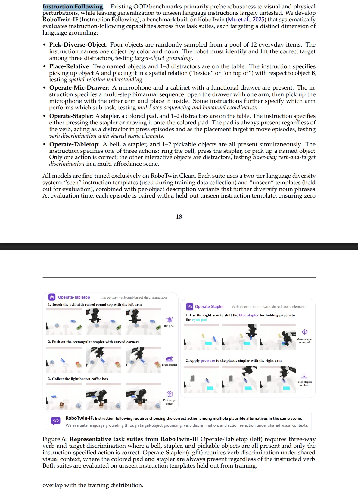

# RoboTwin-IF 复刻

> ⚠️ **"复刻"的性质说明**：RoboTwin-IF 原始代码未开源，我们无法对齐到实现细节。本项目实际是**基于论文公开描述（§6.2.1、Table 8、Figure 6/21）+ RoboTwin 2.0 官方文档/源码能力，重新实现一个语义/行为上尽量靠近的近似版本**，不是逐行/逐参数还原。凡是论文未明确给出的细节（成功判定阈值、场景随机化具体分布、干扰物摆放规则等），都只能类比 RoboTwin 2.0 原生同类任务的实现模式来猜，做的时候要显式标注"这是我们的假设，非原文确认"。

## 来源

- 论文：[Qwen-RobotManip Technical Report](https://arxiv.org/abs/2606.17846)(不是最初以为的 2605.30280 / Qwen-VLA)
- 基准原文位置：§6.2.1 "Instruction Following"，Table 8，Figure 6/21
- 基于：[RoboTwin 2.0](https://github.com/RoboTwin-Platform/RoboTwin) 官方仿真环境（SAPIEN 引擎，50个双臂任务）

### 论文原文截图（§6.2.1 + Figure 6）

论文对 5 个任务集的原始文字定义（§6.2.1）+ Figure 6 示例图（Operate-Tabletop、Operate-Stapler 两个任务集的分步演示）。后面"5个任务集"表格的中文描述以此截图为准，如有出入以截图/原文为准。

## 复刻范围（已确认）

**只复刻基准本身**：在 RoboTwin 2.0 上实现 5 个任务集（场景随机化、干扰物、指令模板、成功判定），产出可评测任意 policy 的 harness。**不训练模型**，不绑定具体 VLA。

- 代码仓库：`C:\Users\xichen6\Documents\repos\robotwin-if`（独立 git repo，不放笔记库）
- 本文档及后续设计笔记：留在 Obsidian 笔记库 `工作/1-Projects/` 下，同步副本已放入代码仓库 `docs/design.md` 供代码引用（此文件是原件，改动后需要手动同步一份到仓库）
- 运行环境（Linux/WSL2 + GPU）：**暂不确定，本阶段只做方案设计，不在本机跑仿真**

## RoboTwin-IF 是什么（论文原始设计）

诊断 VLA policy 是否真的按语言指令控制动作，而不是退化成"看图选默认动作"（论文称 VLA→VA degradation）。核心机制：**seen/unseen 指令模板隔离**——训练只用 seen 模板，评测换成从没见过的 unseen 模板，确保评测阶段与训练语言分布零重叠。

### 5 个任务集

| 任务集                 | 场景           | 指令内容                                  | 测试维度           |
| ------------------- | ------------ | ------------------------------------- | -------------- |
| Pick-Diverse-Object | 12物体池随机采4个   | "颜色+名词"点名1个目标，其余3个是干扰项                | 目标物体 grounding |
| Place-Relative      | 2命名物体+1-3干扰物 | 把A放到B"旁边/上面"                          | 空间关系理解         |
| Operate-Mic-Drawer  | 麦克风+带抽屉柜子    | 多步双臂序列（开抽屉→放麦克风），部分指令指定哪只手做哪步         | 多步序列+双臂协调      |
| Operate-Stapler     | 订书机+彩色垫+干扰物  | "按订书机" 或 "移到垫子上"，垫子在两种场景里角色不同（干扰项/目标） | 共享场景下动词判别      |
| Operate-Tabletop    | 铃铛+订书机+可拿物体  | 三选一（摇铃/按订书机/拿指定物体）                    | 三选一动词+目标判别     |

### 与 RoboTwin 2.0 原生任务的关系（调研发现，论文未明说）

RoboTwin 2.0 官方 50 个任务里已有高度相关的原生任务，RoboTwin-IF 大概率是在这些任务基础上**加干扰物、加多样化指令**改造而成，而不是从零建场景：

- Operate-Stapler ← `Press Stapler` + `Move Stapler Pad`（原生就是两个独立任务，RoboTwin-IF 把它们合并成同场景内的动词判别）
- Operate-Tabletop ← `Click Bell` + `Press Stapler` + 拾取类任务组合
- Operate-Mic-Drawer ← `Handover Mic`（原生），drawer 部分官方 50 任务里没有直接同名任务，需要用 `Open Laptop`/`Put Object Cabinet` 这类带铰接物体（articulated actor）的任务作为参考，或者用场景资产库里的抽屉柜 asset 自建
- Pick-Diverse-Object / Place-Relative：官方任务里没有直接对应（`Pick Diverse Bottles` 只局限瓶子），需要新建，但可以复用 RoboTwin 的物体资产库和 `place_actor()` 的 "beside/on top of" 对齐能力

### RoboTwin 2.0 原生的语言多样性机制（关键发现，大幅简化复刻工作）

RoboTwin 2.0 **本身就自带**一套 MLLM 驱动的指令/物体描述生成管线，不需要我们自己发明：

- 每个任务的语言模板库：**60个模板 + 每个物体15条描述**，随机组合实例化
- 每次离线生成 12 条指令，切分为 **10条 seen / 2条 unseen**，**存成静态文件** `description/task_instruction/{task_name}.json`（⚠️ 更正：不是运行时动态切分，是提前用MLLM生成好、以json形式存在，运行时直接读取——见 [[01-环境搭建]] 里对 `collect_data.py` 源码的调研）
- 这套机制来自 RoboTwin 2.0 的 "Description Gen (Object & Task)" 模块

**结论**：RoboTwin-IF 很可能不是重新发明 seen/unseen 机制，而是直接复用 RoboTwin 2.0 原生的这套 description-gen 管线，只是在 5 个新/改造任务上接入它。这意味着我们复刻的重点是**任务场景本身**（干扰物摆放、成功判定），语言模板生成可以直接吃 RoboTwin 2.0 现成的工具链——但要新增一份 `{task_name}.json`。

### Task API 要点（供后续实现参考）

- 任务类继承 `Base_Task`
- 核心动作：`grasp_actor()`（抓取，支持 `contact_point_id` 选择抓取点）、`place_actor()`（放置，支持 `free/align/auto` 对齐策略 + `functional_point_id`）、`move_by_displacement()`、`move_to_pose()`、`open_gripper()`/`close_gripper()`
- 物体（Actor）暴露 4 类关键点：target point、contact point、functional point、orientation point
- 动作需先"预生成"序列，再用 `move()` 统一执行（同一个 `ArmTag` 不能在一次调用里传两次，即左右臂动作要分开传）

## 决策：RoboTwin 2.0 集成方式

**选定：third-party 依赖引入，不 fork。**

- RoboTwin-Platform/RoboTwin 作为 git submodule（锁定版本）纳入 `robotwin-if` 仓库，不修改其源码
- 5个任务集的代码、指令配置、评测逻辑全部维护在 `robotwin-if` 自己的目录下
- 调研确认（详见 [[01-环境搭建]]）：桥接点其实有 **3 处**，都按 `task_name` 命名对齐，不是只有 `envs/`：
  1. `envs/{task_name}.py`，内部 `class {task_name}(Base_Task)` — 类名必须和文件名/task_name完全一致
  2. `description/task_instruction/{task_name}.json` — 静态指令模板文件（seen/unseen 数组提前生成好存在这里，不是运行时切分）
  3. 新物体需要 `description/objects_description/{obj_id}_{name}/` 下的描述文件（复用现有120个物体的话可以跳过）
  用薄的安装/桥接脚本（symlink 或构建期复制）把 `robotwin-if` 维护的文件接入 submodule 对应的这几个目录，而不是把代码物理写进 fork 里
- 好处：跟上游升级容易、改动边界清晰（diff 全在 robotwin-if）、避免维护一份长期漂移的 fork
- 风险：桥接脚本本身需要在真正连上仿真环境后验证可行——留到环境确定之后的实现阶段验证

## 合并评测(原生50 + 新增5)可行性调研（已看实际源码确认）

结论：**好做**，评测调度机制本身是配置驱动的，不需要碰 submodule 源码。

- 任务发现：`importlib.import_module(f"envs.{task_name}")`（`scripts/eval_policy_xpolicylab.py` / `collect_data.py`），`envs/` 是扁平目录，文件名即 `task_name`，印证桥接方案可行
- 任务列表就是一份 YAML：`env_cfg/eval/all_tasks.yml` 下面一个 `tasks:` 列表，50个任务名
- 评测入口 `scripts/eval_policy.sh multitask --config <yml路径> ...`，`--config` 接受任意路径（`Path.resolve()`，未限定必须在 submodule 内）→ **不用改 submodule 里的 all_tasks.yml**，在 `robotwin-if` 自己维护一份 `all_tasks_plus_if.yml`（原50个 + 新增5个任务名）即可
- per-task 随机化/具身参数是共享配置，不是一任务一份：`--task-config demo_clean` 对应 `env_cfg/task_config/demo_clean.yml`，里面有 `eval_instruction: seen|unseen` 等通用字段，50个原生任务和新增5个任务共用同一份，不需要给每个新任务单独写 task_config

**要做的事**（对应之前的桥接方案）：
1. 5个新任务 `.py` 文件继承 `Base_Task`，实现 `check_success()` 等接口，放在 `robotwin-if` 自己目录
2. 安装期脚本把它们 symlink/复制进 submodule 的 `envs/`（文件名即 `pick_diverse_object.py` / `place_relative.py` / `operate_mic_drawer.py` / `operate_stapler.py` / `operate_tabletop.py`）
3. `robotwin-if` 里维护 `all_tasks_plus_if.yml` = 原50 + 新增5，跑 `eval_policy.sh multitask --config <这份yml>` 即可拿到合并分数

## 时间评估（分阶段，人天，1人全职）

| 阶段 | 笔记 | 内容 | 预估人天 | 备注 |
|---|---|---|---|---|
| 1. 环境搭建+跑通基线 | [[01-环境搭建]] | 远程机器有现成安装脚本可以直接装 RoboTwin，再验证桥接机制 | **1 – 1.5** | 因为有安装脚本，风险下调（原估2-3天） |
| 2. 复用型任务(2个) | [[02-Operate-Stapler]]、[[03-Operate-Tabletop]] | 魔改自现有 press_stapler/click_bell/move_stapler_pad | 2 – 3 | 中等风险 |
| 3. 新建型任务(2个) | [[04-Pick-Diverse-Object]]、[[05-Place-Relative]] | 无原生对应，成功判定要自己设计 | 3 – 4 | **较高风险**：论文未公开判定细节，需自行设计+反复试错（用户已确认这是主要不确定项） |
| 4. 最复杂任务(1个) | [[06-Operate-Mic-Drawer]] | 双臂多步+抽屉资产 **未知是否已有现成资产** | 2.5 – 4（若需自建/改URDF资产，+1-2天） | **未知项**：抽屉资产是否现成，待第1轮环境搭建后实地确认 |
| 5. 指令模板接入 | [[07-指令模板接入]] | 接入原生 description-gen 管线 | 1 – 1.5 | 低风险 |
| 6. 合并评测集成 | [[08-合并评测集成]] | 维护 all_tasks_plus_if.yml，验证合并评测跑通 | 0.5 – 1 | 低风险 |
| 7. 联调/回归/文档 | （不单独建笔记，最后回到主文档记录） | 完整跑一遍+修bug+文档 | 1.5 – 2 | 常规缓冲 |

**总计：约 11.5 – 17 人天（~2.5 – 3.5 周）**。最大不确定性来自阶段3/4的成功判定设计（论文未公开细节，需自行摸索）和阶段4的抽屉资产可用性（需环境搭建后现场确认）。

## RoboTwin 2.0 submodule 版本锁定

**选定 commit：`0aeea2d669c0f8516f4d5785f0aa33ba812c14b4`**（2026-04-19，"Update curobo git clone to version v0.7.8"），比当前上游 HEAD 落后约43个commit(~4个月)。

来源：用户提供了一份现成的 CogACT 项目 `third_party/robotwin` 环境搭建脚本，该脚本已经把整套依赖/patch 针对这个具体 commit 调通过。直接复用理由：

- 配套了针对该 commit 调好的关键 patch，换新 commit 可能失效，需要重新验证：
  - SAPIEN `wrapper/urdf_loader.py`：open() 加 `encoding="utf-8"`
  - mplib `planner.py`：screw plan 里去掉 collision check 条件
  - CuRobo 锁定到 commit `d64c4b005459db10c5dd867d8b30a87d5bda9bdb`（对应 v0.7.8），装在 `envs/curobo` 下，`pip install -e . --no-build-isolation`
  - pytorch3d：优先 fbaipublicfiles 预编译 wheel，失败则 `pip install git+...@stable --no-build-isolation`
- 省掉环境搭建阶段的 SAPIEN/CUDA 兼容性踩坑（这是之前时间评估里阶段1的最大风险项）
- 权衡：落后上游约4个月，如果上游后续对 `envs/` 目录结构或 description-gen 管线有破坏性改动会错过，但目标是对齐已验证环境，可接受

依赖安装清单（供实施计划环境搭建步骤参考）：Vulkan/Mesa渲染依赖、conda环境`RoboTwin`(python 3.10)、`script/requirements.txt`、pytorch3d、curobo、`json_numpy requests imageio scipy pyyaml opencv-python tqdm matplotlib einops flask omegaconf pillow transformers timm peft warp-lang==1.12.1`，以及 `setuptools<70`（版本兼容需要强制降级）。Assets 下载支持本地缓存目录 symlink 复用，避免重复下载。

## 基准验证计划

如何知道复刻的基准"work了"，分三层，**本轮实施计划只做 Layer A + B，Layer C 留到后面单独做**：

- **Layer A（结构/集成正确性）**：5个任务能被 `envs.<task_name>` 正确 import；接入 `all_tasks_plus_if.yml` 后 `eval_policy.sh multitask` 能跑通合并调度不崩；seen/unseen 指令模板池断言无重叠
- **Layer B（单任务判定逻辑正确性）**：用 RoboTwin 自带的脚本化/运动规划 oracle（RoboTwin 本身靠脚本生成专家演示，不需要训练模型）对每个任务集分别验证：
  - 正例：oracle 按指令操作正确目标 → `check_success()` 应稳定为 True（允许仿真物理随机性，不要求100%）
  - 反例：oracle 故意操作干扰物而非指令目标 → `check_success()` 应稳定为 False（最容易漏的坑：只检查"某物体到了目标位置"而没检查"是不是指令指定的那个物体"）
  - 作为每个任务集"完成"的验收标准之一，写进实施计划
- **Layer C（基准区分度验证，留到后面）**：用"瞎猜/默认动作 baseline"（应接近 chance level，如 Pick-Diverse-Object 4选1约25%）和"作弊 oracle baseline"（应接近100%）两个对照实验，验证基准本身有没有区分度、场景设计有没有偏置。这一层暂不纳入本轮实施计划范围。
- **Layer D（与原论文的外部对齐度，只能做粗略 sanity check，不追求一致）**：因原仓库未开源，我们的实现**不可能**验证与论文内部实现细节一致，只能做数量级层面的合理性检查——用我们复刻的基准跑一个真实 VLA policy（或至少 oracle/瞎猜 baseline），success rate 数值量级如果和论文 Table 8 报告的相差过大（比如论文某任务集80%+，我们跑出来只有10%或反过来接近100%），说明理解可能有系统性偏差，需要回头检查"信息来源与可信度"表里标注为"低可信度"的那些判定逻辑设计。这一层结论只能提示"可能有问题"，不能证明"完全对了"——即使数值量级接近，也可能是不同实现凑巧撞出相近数字。

## 未决问题 / 下一步要澄清

1. **成功判定细节**：论文没公开具体接触检测/阈值实现，只能参照 RoboTwin 2.0 原生同类任务（如 `press_stapler`、`click_bell`）的判定代码模式类推，做不到 100% 还原论文内部实现，只能做语义等价复刻。
2. **Operate-Mic-Drawer 的 drawer 资产**：需要去 RoboTwin 2.0 的 asset 库确认是否有现成带功能性抽屉的 cabinet asset，或者需要新建/改造 URDF。
3. **运行环境**：✅ 已决定——**远程 Linux GPU 机器**，用户自己 SSH 手动登录执行/验证；Claude 侧只负责在本机编写代码/脚本，不代为连接执行。待补充：GPU型号与数量、是否已装好 CUDA/SAPIEN 依赖——这些决定实施计划里"环境搭建"步骤要不要包含依赖安装脚本。
4. **评测指标口径**：论文 Table 8 报告的是每个任务集的 success rate 均值，我们复刻后要不要也做"training steps 消融"（Figure 21 那种）——这属于训练侧实验，超出"只复刻基准"的范围，先不做。

## 信息来源与可信度

因原仓库未开源，各处设计决策依据的可信度不一，实现时要留意区分，避免把"我们的推测"当成"论文事实"来用：

| 可信度 | 来源类型 | 用在哪些设计点 | 备注 |
|---|---|---|---|
| **高**（论文原文明确写的） | 论文正文/Table 8/Figure 6 | 5个任务集的名称、场景构成、测试维度；seen/unseen 隔离的核心机制描述 | 直接引用，不需要类推 |
| **中**（从图表/描述反推，非直接给出实现） | 论文 Figure 21（消融曲线）、Table 8 数值量级 | success rate 大致范围、任务难度相对排序 | 只能作为"合理性 sanity check"，不能反推具体实现参数 |
| **中**（RoboTwin 2.0 官方文档/源码，非 RoboTwin-IF 专属） | [RoboTwin 2.0 Task API](https://robotwin-platform.github.io/doc/usage/API.html)、[50个任务列表](https://robotwin-platform.github.io/doc/tasks/index.html)、`collect_data.py`/`generate_episode_instructions.py` 源码 | Task API 用法、桥接机制、description-gen 管线 | 这部分是"平台能力"，可信但不代表 RoboTwin-IF 就是这么用的，是我们的选择 |
| **低**（类比原生任务模式，纯推测） | 对照 `press_stapler`/`click_bell` 等原生任务的判定代码模式 | 5个新/改造任务的 `check_success()` 具体阈值、接触检测逻辑 | **必须在代码注释和实现记录里显式标注"参照 XX 原生任务类推，非论文确认"** |
| **未知/待确认** | Operate-Mic-Drawer 的抽屉资产是否现成 | 阶段4 | 需环境搭建后实地查 asset 库确认 |

实现阶段的约定：每个任务的实现记录（如 `02-Operate-Stapler.md`）里，涉及"低可信度"的判定逻辑设计，要单独写一条"依据：类推自 XX，论文未确认"，方便以后如果论文补充细节或原仓库开源了，能快速定位哪些地方需要回头对照修正。

## 参考链接

- [Qwen-RobotManip Technical Report (arXiv 2606.17846)](https://arxiv.org/abs/2606.17846)
- [RoboTwin-Platform/RoboTwin (GitHub)](https://github.com/RoboTwin-Platform/RoboTwin)
- [RoboTwin 2.0 官方文档](https://robotwin-platform.github.io/doc/index.html)
- [RoboTwin 2.0 Task API](https://robotwin-platform.github.io/doc/usage/API.html)
- [RoboTwin 2.0 50个任务列表](https://robotwin-platform.github.io/doc/tasks/index.html)
