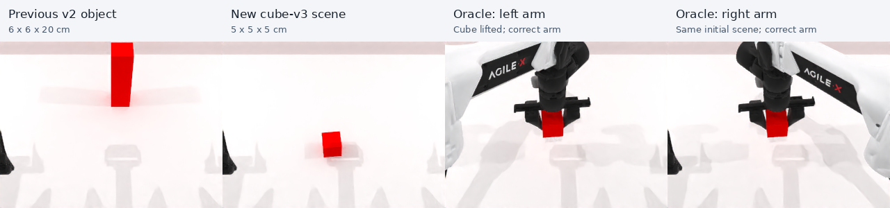
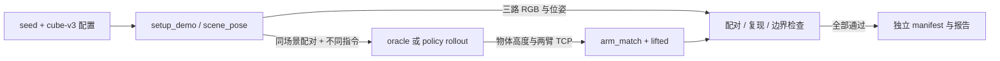
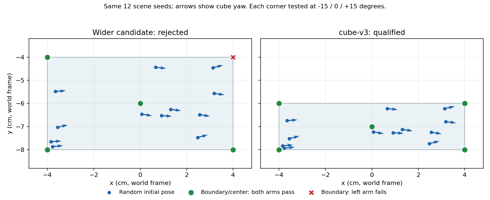

# Arm-Select cube-v3：输入、处理与输出

2026-09-18 补充：[新成功判据](../arm-select-target-arm-only.md) 会记录整回合的错误手臂抬升，
先错后对仍失败。下文是 2026-09-16 的场景改动与旧判据验证记录，已发布 policy 成绩尚未按新判据重跑。

核对日期：2026-09-16。范围：任务环境、配对语言、oracle 预检与历史结果备份。
父仓库基线 `9db9463d0659d0ba13470403a9b529387e297a55`；RoboTwin 检出及 gitlink
均为 `b82ffb81d291d14c24be444bb7b6f81719481e0f`，存在本地桥接及配置修改。
环境源码由 RoboTwin 中的链接加载到本仓库；本次没有重置这些已有修改。

## 目的与实现

通过独立配置把原 6 × 6 × 20 cm 长柱换成原生 `stack_blocks_three` 使用的
5 × 5 × 5 cm 红色 cube，提供原生上方抓取姿态，降低执行难度，让 arm instruction
成为主要考察点。上方抓取是 oracle 的执行方式，policy 成功判据不额外要求抓取方向。



位置和旋转由 `scene_seed = seed // 2` 的局部 RNG 采样，指令手臂只由 seed 奇偶决定。
不同 scene seeds 改变初始位置和 yaw；相同 seed 的 reset 可复现，同一 left/right pair
保持相同场景和同一句式，只替换手臂词。cube 平放，roll/pitch 固定为零，避免倾倒引入额外难度。

源码：[`arm_select.py`](../../tasks/envs/arm_select.py) 的 `setup_demo`、`scene_pose`、
`load_actors`、`play_once`；原生 `envs/utils/create_actor.py:create_box` 的
`boxtype="default"` 提供四个上方抓取姿态。

## 输入契约

| 输入 | 来源、默认与约束 | 依据 |
|---|---|---|
| task | `arm_select`；现有六个 policy evaluator 共用任务和 seed 契约 | `if_benchmark/seed_contracts.py` |
| task_config | 新配置 `demo_clean_arm_select_v3`，指定 `arm_select_scene_version: cube-v3` | `tasks/task_config/demo_clean_arm_select_v3.yml` |
| seed | 成对偶/奇数；偶数 left、奇数 right，scene seed 为整除 2 | `setup_demo` / `load_actors` |
| 初始 translation | 世界坐标 x ∈ [−0.04, 0.04] m，分三段循环采样；y ∈ [−0.08, −0.06] m；生成中心 z=0.766 m | `CUBE_X_BINS` / `CUBE_Y_RANGE` / `CUBE_Z` |
| 初始 rotation | yaw ∈ [−15°, 15°]，roll/pitch=0；四元数顺序 wxyz | `CUBE_YAW_LIMIT` / `load_actors` |
| 物理高度 | cube 下表面初始在 0.741 m，随后物理沉降；相对抬升基线在 setup 后记录，支持原生 table bias | `setup_demo` / `create_actor.preprocess` |
| oracle | default cube 的 contact ids 0–3；预抓取 9 cm、上抬 10 cm | `play_once` |
| policy 预算 | 400 actions，保持原判据：相对抬升 >5 cm，距指定 TCP <20 cm 且比另一 TCP 更近 | `_if_eval.py` / `_compute_signals` |
| 语言 | 所有版本沿用 `the block` 及原模板；cube-v3 与 jitter-v2 按 scene seed 选模板 | `policies/xvla/eval.py:instruction_for` |

`fixed-v1` 仍是未传版本时的默认值；旧 `demo_clean_arm_select_v2` 仍生成长柱。
v3 必须显式选择新配置，旧 manifest 与新配置不匹配时 evaluator 会拒绝。
Cube-v3 已纳入[新的六任务 taskset](../../seed-manifests/robotwin-if-cube-v3-20-per-mode/README.md)，
六个 policies 的独立重跑与五任务复用见[合并评测说明](../arm-select-cube-v3-evaluation.md)。

## 输出与数据流

| 输出 | 路径/消费者 | 条件与证据状态 |
|---|---|---|
| 场景元数据 | `env.info['arm_select_scene']`，包含位姿、分区、尺寸、boxtype | 源码定义；不进入 instruction placeholders |
| 分离信号 | `eval_signals()` 的 `arm_match` / `lifted` / 相对高度 / 两臂距离 | 供 evaluator 记录；`check_success` 为前两者 AND |
| 备份 | [`bak/arm_select-long-v2-20260916`](../../bak/arm_select-long-v2-20260916/README.md) | 已复制源码、发布包和 240 回合视频/动作/记录，约 297 MiB；JSON 哈希核对通过 |
| 探索原始证据 | `outputs/policy-eval/arm-select-cube-v3-probe-00N/`、`arm-select-cube-v3-validation-001/`、`arm-select-cube-v3-20blocks-001/` | 本次运行：源码快照、哈希、GPU/阶段日志、每回合初始 NPZ 和初末 PNG |
| 验证结论 | 上述目录的 `episodes.json` / `blocks.json` / `report.json` | 失败也保留；`complete=true` 表示跑完，`all_checks_passed=true` 才表示全通过 |
| qualified manifest | 上述目录的 `arm_select.json` | 仅在候选双臂、配对一致性、复测、错误手臂反例及启用的边界检查全部通过后写出 |
| 可复用清单与证据 | [20-block 清单](../../seed-manifests/arm-select-cube-v3-20-per-mode/README.md) / [开发集](../../seed-manifests/arm-select-cube-v3-dev-12-per-mode/README.md) / [独立验证集](../../seed-manifests/arm-select-cube-v3-validation-12-per-mode/README.md) | 已复制全通过的 manifest、逐回合报告及源码哈希；后两份各 12 个 blocks |



## 验证结果与边界

- 第一轮 `probe-001` 保留 v2 的 x ±2 cm、y 10–12 cm、yaw ±3°：24 次 cube 抓取
  全部规划失败。原始失败与当时源码保留，未替换 seeds。
- 第二轮 `probe-002` 移到前侧中央，x ±4 cm、y −8 至 −4 cm、yaw ±15°：
  24/24 随机场景抓取、6/6 复测、6/6 错误手臂反例通过，但边界只有 23/26 通过。
  x=+4 cm、y=−4 cm 的左臂在三个 yaw 下均抬升规划失败，因此该范围未获 manifest。
- 第三轮 `probe-003` 保持原先 12 个 blocks（seeds 300000–300023），把 y 上界收紧到 −6 cm。
  再次检查 4 个 xy 角点 × 3 个 yaw（−15°/0°/+15°）和中心点，每点左右臂各执行一次。
  另用 `validation-001` 的 seeds 400000–400023 检查未参与上述范围调整的 12 个新场景。
  两轮分别 **64/64、38/38 检查通过**，supervisor 均正常退出。源码和配置哈希与当前交付一致。
- `20blocks-001` 使用另行预先固定的 seeds 500000–500039，与上述两批无重叠。
  **20/20 blocks、54/54 检查回合通过**，未替换候选 seed；x 左/中/右分区各 6/7/7 个场景。
  六个 policy evaluator 均能加载该清单并选择完整 20 blocks；逐项记录见清单目录的 `verification.json`。

| 检查 | 开发集 probe-003 | 独立 validation-001 | 20blocks-001 |
|---|---:|---:|---:|
| 正确手臂随机场景抓取 | 24/24 | 24/24 | 40/40 |
| 正确手臂复测 | 6/6 | 6/6 | 6/6 |
| 错误手臂抬起但判失败 | 6/6 | 6/6 | 6/6 |
| xy 角点 × yaw 极值/零值及中心，左右臂各一次 | 26/26 | — | — |
| fixed-v1 历史回归 | 2/2 | 2/2 | 2/2 |
| 配对三路 RGB / 位姿 / 句式完全一致 | 12/12 blocks | 12/12 blocks | 20/20 blocks |

三批合计 44 个不同初始场景，复测图像也完全重现。独立验证集实际抬升约 9.8–10.2 cm，
指定 TCP 距离最大约 13.1 cm，另一臂距离最小约 36.9 cm；当前 20 cm TCP 阈值保留充足区分。



- CPU 检查：arm_select 10 项、共享 setup 9 项、step-limit 16 项通过。
  覆盖配对位姿/语言、跨场景变化、版本 reset 隔离、无 oracle 的 policy 成功与错误手臂拒绝。
- 更广的 `test_if_policy_evaluation` 中，六个 policy 的旧 place_relative v1 manifest
  包含已下线模式，产生 6 个子用例错误；用备份的改动前 evaluator 复现相同错误。
  此问题与本次 arm_select 修改无关。
- 旧 fixed-v1 / jitter-v2 采样器与备份源码逐值比较，两个版本各 10,000 个 scene seeds 完全相同。
- 有限样本和边界测试不能证明整个连续空间必然可达；正式 evaluator 仍逐 seed 做 oracle qualification。
  上述结果为 oracle 验证，不能当成 policy 改善幅度；策略结果由后续独立重跑产生。

## 最小调用

工作目录为仓库根目录，Python 使用已经安装 SAPIEN/CuRobo 的 RoboTwin 环境。
本地已创建下述配置链接；新 checkout 需先安装 task bridge，再链接配置：

```bash
ln -s "$(pwd)/tasks/task_config/demo_clean_arm_select_v3.yml" third_party/robotwin/task_config/demo_clean_arm_select_v3.yml
```

本次第三轮命令（输出目录必须不存在）：

```bash
/home/xichen6/miniconda3/envs/RoboTwin/bin/python tools/probe_arm_select_variation.py \
  --scene-version cube-v3 --blocks 12 --seed-start 300000 --check-boundaries \
  --sim-gpu 0 --output outputs/policy-eval/arm-select-cube-v3-probe-003
```

独立验证也已执行：同一命令改用 `--seed-start 400000`、`--sim-gpu 1`，省略
`--check-boundaries`，输出到 `outputs/policy-eval/arm-select-cube-v3-validation-001`。

20-block 清单生成也已执行：改用 `--blocks 20 --seed-start 500000 --sim-gpu 0`，省略
`--check-boundaries`，输出到 `outputs/policy-eval/arm-select-cube-v3-20blocks-001`。

预检默认还对 fixed-v1 的两个历史回合逐像素核对三路初始 RGB，默认参考位置是
`outputs/policy-eval/if-seven-tasks-2blocks-001`；参考归档不在此处时用 `--reference PATH`。
脚本需要本地 GPU，无模型 server；现有输出目录直接拒绝覆盖。

六个 policy evaluator 均可使用已生成的清单，模型连接参数沿各 policy README：

```text
--task arm_select
--task-config demo_clean_arm_select_v3
--seed-manifest seed-manifests/arm-select-cube-v3-20-per-mode/arm_select.json
--blocks 20
--output-dir <新的独立结果目录>
```

六任务正式运行已使用 20-block 清单调度六个 policies，状态与结果入口见[合并评测说明](../arm-select-cube-v3-evaluation.md)。
