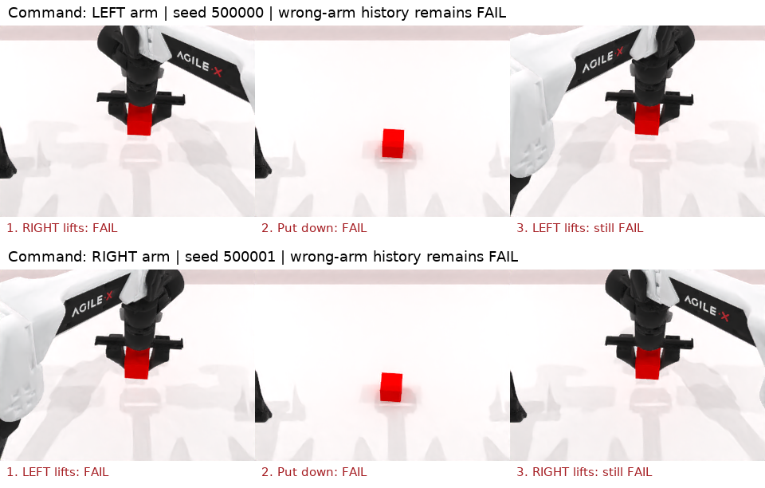

# Arm-Select：错误臂后换指定臂的验证

2026-09-18，`target-arm-only-lift-v2` 的 **4/4 组真实仿真检查通过**，另有 **76 项 CPU 回归通过**。
这些是诊断控制，不是模型评测，不计入正式成绩。

| 指令 | 动作过程 | 最终抬升 | 旧终态规则 | 新规则 |
|---|---|---:|---|---|
| 左臂，seed 500000 | 左臂直接抓取 | 9.824 cm | 成功 | 成功 |
| 左臂，seed 500000 | 右臂抓起→放回→退回→左臂抓起 | 9.831 cm | 成功 | **失败** |
| 右臂，seed 500001 | 右臂直接抓取 | 9.835 cm | 成功 | 成功 |
| 右臂，seed 500001 | 左臂抓起→放回→退回→右臂抓起 | 9.833 cm | 成功 | **失败** |

所有移动均通过真实机器人 oracle 动作完成，没有传送物体、手臂或篡改监控状态。
两个反例在最终状态下均满足原来的高度和指定 TCP 距离条件，但错误臂历史标记保持为真。
放回时高度回到桌面基线；错误历史不因放下或再次 `play_once` 清除。



- [阶段信号与源码哈希](report.json)
- [验证记录、逐物理步历史检查、视频帧数及原始文件哈希](validation.json)
- [新判据及边界说明](../../../../docs/arm-select-target-arm-only.md)
- [可复现的真实仿真脚本](../../../../tests/arm_select/verify_target_arm_only.py)

4 组初始观测逐数组匹配已归档 cube-v3 X-VLA 同 seed 的三路 RGB 与 proprio。
两个反例共记录 7160 个物理步，错误历史从首次触发到结束均保持，期间从未返回新判据成功。
验证过运行时源码与当前源码哈希一致；视频采样帧数与物理步和阶段截图数量一致。

CPU 回归包括 Arm 成功判据与场景/语言配对 17 项、正式计划与结果复用 25 项、
Attribute 9 项、评测初始化/终态 9 项、动作预算 16 项。空中换手、一个动作内部短暂使用错误臂、
轻碰未超过抬升阈值、严格距离阈值、reset/close 均覆盖。
空中换手仅做了 CPU 状态序列验证；上述真实仿真反例采用放回桌面再抓取的过程。

原始视频、阶段 PNG、初始 NPZ、逐物理步信号、日志和源码快照在 msrait-04：

```text
/Data/robotwin-if/evaluations/arm-select-target-arm-only-v2-review-001/
```

每个 case 子目录中的 `rollout.mp4` 为完整采样视频，`physics-trace.json` 为逐物理步记录。
当前 Arm-only-v2 的 Arm 回合已按本判据重跑，见[完整成绩](../../README.md)。
